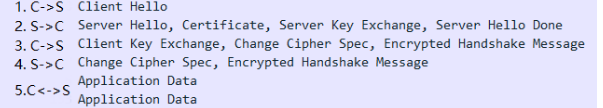
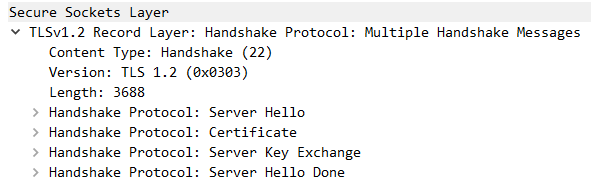
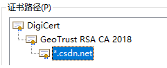
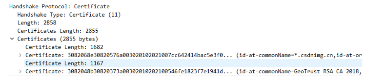
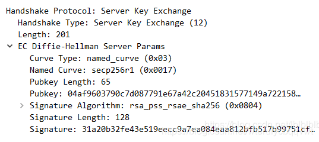

# 第5周-5.9

## 1 IDEA 比较两个文件差异

在目录树里选中两个文件，右键->`compare files`。

## 2 TLS-v1.2与SSL-v3.1

[TLSv1.2介绍及Https协议SSL建立过程分析（OpenSSL源码）](https://blog.csdn.net/wteruiycbqqvwt/article/details/90764611)

**SSL3.1就是TLS1.0**

### 2.1 TLSv1.2协议

3个作用：

1. 身份认证：通过**证书认证**来确认对方的身份，防止中间人攻击
2. 数据私密性：使用**对称性密钥加密**传输的数据，由于密钥只有客户端/服务端有，其他人无法窥探。
3. 数据完整性：使用**摘要算法**对报文进行计算，收到消息后校验该值防止数据被篡改或丢失。

#### 2.1.1 TLS传输过程

使用`wireshark`抓包的结果：

其中`1-4`是握手阶段，`5`是指握手后双方使用商议好的秘钥进行通讯。

`2`中并列着`Server Hello`,`Certificate`等多个类型，是因为这是一个`Multiple Handshake Messages`，一次性发送多个握手协议包，如下图所示：

#### 2.1.2 传输过程总体描述

（1）客户端提供【客户端随机数、可选算法套件、sessionId】等信息
（2）服务端提供【服务端随机数、选用算法套件、sessionId】等信息
（3）服务端提供证书
（4）服务端与客户端互换算法需要的参数
（5）客户端根据前面提到的随机数和参数生成master secret，确认开始使用指定算法加密，并将握手信息加密传输给服务端，用来校验握手信息、秘钥是否正确
（6）服务端进行与（5）一样的操作
（7）客户端、服务端可以用master secret进行加密通讯

#### 2.1.3 传输中的一些参数

**cipher suites：算法套件**

每个算法套件是一组算法，以`TLS_ECDHE_RSA_WITH_AES_128_GCM_SHA256`为例。
其中

* `ECDHE`：用于协商秘钥 https://blog.csdn.net/mrpre/article/details/78025940
* `RSA`：用于身份验证
* `AES_128_GCM`：用于对称加密通讯
* `SHA256`：用于生成摘要，验证数据完整性

**秘钥协商过程**

这里涉及到几个参数，`client random`，`server random`，`pre master key`，`master key`，其中`master key`是最终协商出来的秘钥，后续对称加密通讯都是使用`master key`。

（1）`master key`是使用伪随机算法，结合`client random`，`server random`，`pre master key`三个随机因素生成的。

（2）`client random`和`server random`是客户端和服务端分别生成的随机数，这样增加了随机性。

（3）`pre master key`也是通过一定规则计算出来的随机数。
我们依旧以`TLS_ECDHE_RSA_WITH_AES_128_GCM_SHA256`为例讲述一下`pre master key`的生成过程。

>① 客户端随机生成随机值Ra，计算Pa = Ra * Q(x, y)，Q(x, y)为全世界公认的某个椭圆曲线算法的基点。将Pa发送至服务器。
>② 服务器随机生成随机值Rb，计算Pb - Rb * Q(x, y)。将Pb发送至客户端。
>由于算法的不可逆转性，外界无法通过Pa、Pb推算出Ra、Rb
>③ 因为算法保证了Ra * Pb= Rb *Pa，所以客户端计算S = Ra * Pb；服务器计算S = Rb *Pa，提取其中的S的x向量作为密钥（pre master key）

`TLS`握手过程中服务器和客户端互换参数，就是在交换`Pa`和`Pb`，交换后服务器和客户端可根据`ECDHE`算出同一个`pre master key`。

#### 2.1.4 身份验证过程

做两件事情：

1. 确认服务器发送过来的证书是合法的
2. 确认服务器拥有私钥

**1 验证证书合法性**

以csdn网站为例，其证书结构如下：

服务端发送证书给客户端时，需要发送整个证书链（这里没有传输根证书，我认为是因为浏览器自带了根证书，并且信任它）

每个证书包含了一些**基本信息**、**证书公钥**和**证书签名**。其中证书签名是对证书进行摘要计算，并使用颁发机构的私钥加密生成。

为证实csdn.net证书的合法性，我们需要用GeoTrust RSA CA 2018的公钥对证书签名进行解密，解密后与证书的摘要进行对比，一致证明csdn.net证书是没有问题的。
同样的，我们需要证明GeoTrust RSA CA 2018的合法性，使用DigiCert的公钥。
DigiCert是浏览器信任的根证书，无需校验。

**2 验证服务器拥有私钥**

如果密钥协商过程使用的是RSA算法，则已经验证了服务器拥有私钥
如果密钥协商过程使用的是ECDHE算法，则没有验证服务器的私钥，此时需要在server key exchange时，对数据进行摘要计算并使用私钥加密，如果客户端可以使用公钥正常解密，则证明服务器拥有私钥。

**3 sessionId - 握手重用**

在Hello的过程中，有一个sessionId的字段，是用来重用握手信息的。
（1）第一次握手的时候
客户端发送的sessionId为空，服务端会生成sessionId返回给客户端，并将握手信息保存起来。
（2）再次握手的时候
客户端发送【上次的sessionId】，服务端检查到sessionId存在，返回同样的sessionId，然后就可以直接使用上次商定的秘钥进行通讯了。
（3）session过期时
客户端发送【上次的sessionId】，服务端检查到sessionId不存在，则返回新的sessionId，继续正常的握手流程。

### 2.2 SSL

SSL协议,当前版本为3.1(SSL3.1就是TLS1.0)。它已被广泛地用于Web浏览器与服务器之间的身份认证和加密数据传输.它位于TCP/IP协议与各种应用层协议之间，为数据通讯提供安全支持。

详情可查看：

* [以前的笔记](https://qgao233.github.io/qgaoMajorKnowledge/chapter18/section6/)
* [TLSv1.2介绍及Https协议SSL建立过程分析（OpenSSL源码）](https://blog.csdn.net/wteruiycbqqvwt/article/details/90764611)