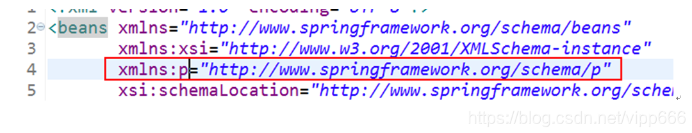

# 第4周-5.5

## 1 spring中单例bean引用原型bean

[spring中单例bean引用原型bean](https://blog.csdn.net/qq_40866844/article/details/122012130)

### 1.1 场景：单例bean引用不变的原型对象

#### 1.1.1 xml文件内容

定义headMaster和student对原型bean，teacher为单例bean。其中teacher中注入headMaster和student属性。

```
<?xml version="1.0" encoding="UTF-8"?>
<beans xmlns="http://www.springframework.org/schema/beans"
       xmlns:xsi="http://www.w3.org/2001/XMLSchema-instance"
       xsi:schemaLocation="http://www.springframework.org/schema/beans
       http://www.springframework.org/schema/beans/spring-beans.xsd">

    <bean id="headMaster" class="com.spring.learn.common.staff.HeadMaster" scope="prototype"/>
    <bean id="student" class="com.spring.learn.common.staff.Student" scope="prototype"/>

    <bean id="teacher" class="com.spring.learn.common.staff.Teacher">
        <property name="headMaster" ref="headMaster"/>
        <property name="student" ref="student"/>
    </bean>

</beans>
```

#### 1.1.2 测试和结果

单例bean的teacher中，headMaster和student属性始终不变。从applicationContext中重新获取对应bean后，返回新建对象。

```
public static void main(String[] args) {

    ClassPathXmlApplicationContext ac = new ClassPathXmlApplicationContext("bean/scope/scope.xml");

    Teacher teacher = ac.getBean("teacher", Teacher.class);
    HeadMaster headMaster = teacher.getHeadMaster();
    Student student = teacher.getStudent();

    HeadMaster headMasterTwo = teacher.getHeadMaster();
    Student studentTwo = teacher.getStudent();

    System.out.println(headMaster);
    System.out.println(headMasterTwo);
    System.out.println(ac.getBean("headMaster", HeadMaster.class));

    System.out.println(student);
    System.out.println(studentTwo);
    System.out.println(ac.getBean("student", Student.class));
}
/*
* com.spring.learn.common.staff.HeadMaster@569cfc36
* com.spring.learn.common.staff.HeadMaster@569cfc36
* com.spring.learn.common.staff.HeadMaster@33723e30
* com.spring.learn.common.staff.Student@64f6106c
* com.spring.learn.common.staff.Student@64f6106c
* com.spring.learn.common.staff.Student@553a3d88
*/
```

### 1.2 保证单例bean引用的原型始终是新建对象

引入 lookup-method或者 replace-method。

#### 1.2.1 更新xml文件

```
<?xml version="1.0" encoding="UTF-8"?>
<beans xmlns="http://www.springframework.org/schema/beans"
       xmlns:xsi="http://www.w3.org/2001/XMLSchema-instance"
       xsi:schemaLocation="http://www.springframework.org/schema/beans
       http://www.springframework.org/schema/beans/spring-beans.xsd">

    <bean id="headMaster" class="com.spring.learn.common.staff.HeadMaster" scope="prototype"/>
    <bean id="student" class="com.spring.learn.common.staff.Student" scope="prototype"/>

    <bean id="teacher" class="com.spring.learn.common.staff.Teacher">
        <lookup-method name="getHeadMaster" bean="headMaster"/>
        <lookup-method name="getStudent" bean="student"/>
    </bean>

</beans>
```

#### 1.2.2 测试和结果

```
public static void main(String[] args) {

    ClassPathXmlApplicationContext ac = new ClassPathXmlApplicationContext("bean/scope/scope2.xml");

    Teacher teacher = ac.getBean("teacher", Teacher.class);
    HeadMaster headMaster = teacher.getHeadMaster();
    Student student = teacher.getStudent();

    HeadMaster headMasterTwo = teacher.getHeadMaster();
    Student studentTwo = teacher.getStudent();

    System.out.println(headMaster);
    System.out.println(headMasterTwo);
    System.out.println(ac.getBean("headMaster", HeadMaster.class));

    System.out.println(student);
    System.out.println(studentTwo);
    System.out.println(ac.getBean("student", Student.class));
}

/*
* com.spring.learn.common.staff.HeadMaster@6b67034
* com.spring.learn.common.staff.HeadMaster@16267862
* com.spring.learn.common.staff.HeadMaster@71248c21
* com.spring.learn.common.staff.Student@442675e1
* com.spring.learn.common.staff.Student@6166e06f
* com.spring.learn.common.staff.Student@49e202ad
*/
```

### 1.3 源码原理

本质上就是对getStudent和getHeadMaster加一层cglib代理，每次执行方法前会经过拦截器，返回application.getBean方法返回的bean对象。

#### 1.3.1 初始化设置属性
初始化teacher时，

`AbstractAutowireCapableBeanFactory`类中的:
```
// lookup-method标签识别入口
522行：mbdToUse.prepareMethodOverrides();
```

`AbstractBeanDefinition`类中的:
```
// BeanDefinition类中的参数methodOverrides，中的参数overrides<类型：Set<MethodOverride>>。
// MethodOverride中的属性参数overloaded 设置为false
1134行：getMethodOverrides().getOverrides().forEach(this::prepareMethodOverride);
```

#### 1.3.2 执行getHeadMaster和getStudent后

`CglibSubclassingInstantiationStrategy`类中的`intercept`方法:

```
// 从当前bean的BeanDefinition信息中，获取重写方法列表中的lookup方法对象。
// 根据此对象信息完成指定对象的实例化
238行：LookupOverride lo = (LookupOverride) getBeanDefinition().getMethodOverrides().getOverride(method);

// 返回 根据xml文件中lookup-method指定bean值，从applicationContext中获取bean的对象。
242行：Object bean = (argsToUse != null ? this.owner.getBean(lo.getBeanName(), argsToUse) :
						this.owner.getBean(lo.getBeanName()));
```

## 2 StringBuffer清空操作

[StringBuffer清空操作delete和setLength的效率对比分析](https://blog.csdn.net/qq_35559358/article/details/77448582)

`setLength()`方法用时较短，因此在StringBuffer 清空操作中，使用setLength(int newLength)方法效率较高。

## 3 stream

[「再学一次系列」一文弄懂Stream API，基操勿6](https://baijiahao.baidu.com/s?id=1722715539548558559&wfr=spider&for=pc)

### 3.1 介绍

流的主要目的就是进行**表达计算**。

stream流是通过一组**原始数据源**转化生成的**元素序列**，支持:
* 数据处理操作（类似数据库的部分操作）
* 类其他函数式编程语言中的常用操作，如：filter、map等

### 3.2 生命周期

类似于一瓶矿泉水的生产：

* 获取水源（准备原始数据）：生成流的元素序列；
* 进入工作台（多个工作台）：流的中间操作，可以有多个中间操作进行衔接，中间操作返回的结果**还是一个流**；
* 装瓶（结束工作）：流的终端操作，无返回值，或返回一个**非流**结果。

### 3.3 操作api

#### 3.3.1 创建流

创建流的方式常见包括：
* Collections.stream()
* Stream.of(args)

创建初始流，包含三个属性(值)：

姓名（卡诺1 - 卡诺5）|年龄（11 - 15）|性别（0 / 1）
:-|:-|:-

后续操作均基于此数据:

```
/** 
* 初始化用户元素序列 
* @return 
*/
public Stream<User> userStream() {    
    // 初始化集合数据    
    List<User> users = new ArrayList<>();    
    for (int i = 0; i < 5; i++) {        
        users.add(new User("卡诺" + (i + 1), 
                            10 + (i + 1), 
                            i % 2)
        );    
    }    
    // 通过元数据构建构建元素序列    
    return users.stream();
}
```

#### 3.3.2 中间操作

**1 filter 过滤器**

接受一个Predicate表达式，筛选满足条件的数据.

```
public void testFilter(){
    userStream().filter(user -> user.getAge() > 14)// 筛选出年龄大于14岁的user           
    .forEach(System.out::println); // 遍历: User(name=卡诺5, age=15, gender=0) 
}
```

注意：forEach为终端操作

**2 sort 排序**

存在重载方法，
* sorted(), 
* sorted(Comparator<? super T> comparator)

```
public void testSort(){
    userStream()             
    .sorted((u1, u2) -> u2.getAge() - u1.getAge()) // 增加一个比较器，按照年龄降序             
    .forEach(System.out::println); // 遍历，倒叙输出所有 
}
```

**3 limit 截断流**

获取指定个数的元素，如果实际小于指定数，那么有多少返回多少。

```
userStream()                
.sorted((u1, u2) -> u2.getAge() - u1.getAge())// 增加一个比较器，按照年龄降序                
.limit(1) // 获取排序后的第一个数据                
.forEach(System.out::println); // 遍历: User(name=卡诺5, age=15, index=0)
```

**4 skip 跳过**

跳过指定个数元素，如果实际小于指定数，那么返回一个空流

```
userStream()                
.skip(4) // 跳过前四个                
.forEach(System.out::println); // 遍历: User(name=卡诺5, age=15, index=0)
```

**5 distinct 去重**

如果操作的元素是对象，则依据对象的hashcode和equals进行去重。

```
Stream.of(1, 1, 3, 2, 3)                
.distinct() // 去重                
.forEach(System.out::print); // 132
```

**6 map 映射**

将流中元素通过操作变成新的元素，接受一个Function表达式。

```
userStream()                
.map(User::getName) // 映射出所有名字                
.forEach(System.out::print); // 卡诺1卡诺2卡诺3卡诺4卡诺5
```

**7 flatMap 映射**

将元素变成新的流，然后把多个新的流再变成一个流

```
// 将名字构建成Stream流   
Function<User, Stream<String>> flatMapFunction = user -> Stream
                                                .<String>builder()
                                                .add(user.getName())
                                                .build();   
// map   
userStream()           
.map(flatMapFunction) // 接收一个Stream           
.forEach(System.out::println); // java.util.stream.ReferencePipeline$Head@7a1ebcd8   
// flatMap   
userStream()           
.flatMap(flatMapFunction) // 接收一个Stream           
.forEach(System.out::print); // 卡诺1卡诺2卡诺3卡诺4卡诺5
```

通过上面的案例可以看出，map返回的是名字构建成Stream流，flatMap则是将返回的流的泛型值平铺合并成一个新的数据元素序列。

#### 3.3.3 终端操作
**1 forEach 遍历元素**

```
userStream().forEach(System.out::println);
```

**2 count 统计总数**

类似SQL中的count，统计数据

```
long count = userStream().count();    
System.out.println(count); // 5
```

**3 max 获取最大值**

max参数为比较器函数，返回类型是Optional

```
Integer max = Stream.of(1, 2, 3, 4)
                .max(Comparator.comparingInt(t -> t))
                .get();    
System.out.println(max); // 4
```

注意： `Comparator.comparingInt(t -> t)` 与`(t1, t2)-> t1 - t2`等价，是Java为我们封装好的`Lambda`写法。

**4 min 获取最小值**

与max用法一致

```
Integer min = Stream.of(1, 2, 3, 4)
                .min(Comparator.comparingInt(t -> t))
                .get();    
System.out.println(min); // 1
```

**5 findFirst 获取第一个**

返回类型是Optional，如果值不存在，返回的是空的Optional

```
Optional<User> firstUser = userStream().findFirst();    
System.out.println(firstUser.get()); // User(name=卡诺1, age=11, gender=0)
```

**6 findAny 获取任意一个**

使用方式类比findFirst，获取任意一个(串行流中一般返回的是第一个，并行流中是随机的)

```
// 串行流    
Optional<Integer> findAny = Stream.of(1, 2, 3, 4).findAny();    
System.out.println(findAny.get());

// 并行流    
Optional<Integer> findAny2 = Stream.of(1, 2, 3, 4).parallel().findAny();    
System.out.println(findAny2.get());
```

注意： parallel()可以将串行流转化成并行流

**allMatch、anyMatch、noneMacth**

接收一个Predicate类型的表达式

**7** `allMacth` 全部匹配

```
// 判断元素是否都大于3    
Predicate<Integer> predicate = (i) -> i > 3;    
boolean allGt3 = Stream.of(1, 2, 3, 4).allMatch(predicate);    
System.out.println(allGt3); // false  

allGt3 = Stream.of(4, 5, 6).allMatch(predicate);    
System.out.println(allGt3); // true
```

**8** `anyMatch` 至少匹配一个

```
// 判断是否存在大于3的元素    
Predicate<Integer> predicate = (i) -> i > 3;    
boolean anyGt3 = Stream.of(1, 2).anyMatch(predicate);    
System.out.println(anyGt3); // false 

anyGt3 = Stream.of(4, 5, 6).anyMatch(predicate);    
System.out.println(anyGt3); // true
```

**9** `noneMacth` 没有匹配到任何一个

```
// 判断是否存在大于3的元素    
Predicate<Integer> predicate = (i) -> i > 3;    
boolean anyGt3 = Stream.of(1, 2).noneMatch(predicate);    
System.out.println(anyGt3); // true 

anyGt3 = Stream.of(4, 5, 6).noneMatch(predicate);    
System.out.println(anyGt3); // false
```

**10 reduce 归约**

将元素序列通过指定的算法反复结合，最终得到一个结果，一般用来计算sum等，reduce是个重载方法，包含

* 单参: `reduce(BinaryOperator<T> accumulator)`
* 双参数: `reduce(T identity, BinaryOperator<T> accumulator)`, 第一个入参可以认为是一个初始化数据
* 三参数: `reduce(U identity, BiFunction<U, ? super T, U> accumulator, BinaryOperator<U> combiner)`, 第三个参数在串行流中不触发，效果等同与双参，但在并行流它用于合并计算

```
// 求和    【单参】
Optional<Integer> reduceOptional = Stream.of(1, 2).reduce(Integer::sum);    
System.out.println(reduceOptional.get()); // 3   
// 求和，增加一个初始化值参与计算   【双参】
Integer reduce = Stream.of(1, 2).reduce(1, Integer::sum);    
System.out.println(reduce); // 4

// 并行流三参        
Integer sum = Stream.of(1, 2, 3).parallel().reduce(4, 
                (t1, t2) -> {            
                    String log = String.join(" | ","中间参数", Thread.currentThread().getName(), t1 + " + " + t2);            
                    System.out.println(log);            
                    return t1 + t2;        
                }, 
                (t1, t2) -> {            
                    String log = String.join(" | ", "第三个参数", Thread.currentThread().getName(), t1 + " + " + t2);            
                    System.out.println(log);          
                    return t1 + t2 ;        
                });        
System.out.println(sum); //5 		
        
// 串行流三参        
sum = Stream.of(1, 2, 3).reduce(4, 
                (t1, t2) -> {            
                    String log = String.join(" | ","中间参数", Thread.currentThread().getName(), t1 + " + " + t2);            
                    System.out.println(log);            
                    return t1 + t2;        
                }, 
                (t1, t2) -> {            
                    System.out.println("执行了第三个参数");          
                    return t1 + t2 ;        
                });        
System.out.println(sum); // 3 
```

输出结果为：
```
中间参数 | main | 4 + 2
中间参数 | ForkJoinPool.commonPool-worker-9 | 4 + 1
中间参数 | ForkJoinPool.commonPool-worker-2 | 4 + 3
第三个参数 | ForkJoinPool.commonPool-worker-2 | 6 + 7
第三个参数 | ForkJoinPool.commonPool-worker-2 | 5 + 1318
中间参数 | main | 4 + 1
中间参数 | main | 5 + 2
中间参数 | main | 7 + 310
```

通过上述输出结果可以看出，并行流中第二个参数使用初始值分别和流中每个元素相加，得出的结果再交给第三个参数进行合并，看起来怪怪的。

**11 collect 收集**

将结果收集为多种类型：常用的有
* collect(Collectors.toList())
* collect(Collectors.toSet())
* collect(Collectors.toMap()) 
* collect(Collectors.groupingBy())，

更多的查看`java.util.stream.Collectors`下提供的方法！

```
// collect(Collectors.toList()) 收集为list    
List<String> nameList = userStream().map(User::getName).collect(Collectors.toList());    
System.out.println(nameList); // [卡诺1, 卡诺2, 卡诺3, 卡诺4, 卡诺5]        

// collect(Collectors.toSet()) 搜集为set    
Set<Integer> set = Arrays.asList(1, 2, 3, 1).stream().collect(Collectors.toSet());    
System.out.println(set); // [1, 2, 3]        

// collect(Collectors.toMap()) 根据名称收集为map，如果key重复需要使用toMap的三参数，设置为覆盖    
Map<String, User> firstUserMap = userStream().limit(1).collect(Collectors.toMap(User::getName, Function.identity()));    
System.out.println(firstUserMap); // {卡诺1=User(name=卡诺1, age=11, gender=0)}        

// collect(Collectors.groupingBy()) 根据名称分组    
Map<String, List<User>> collect = userStream().limit(1).collect(Collectors.groupingBy(User::getName));    
System.out.println(collect); // {卡诺1=[User(name=卡诺1, age=11, gender=0)]}
```

以上仅列出常见的Stream操作，Lambda中有特化的内置函数接口，Stream也有，比如：IntStream、LongStream等，使用流程和Stream一样，或增加一些常用的统计方法比如sum等。

**12 parallelstream并行流**

上面我们探讨的大都是串行流，而Java同样也为我们提供了更加快捷的并行处理方式，并行流就是将一块内容分成多块交由不同的线程处理，线程池由`ForkJoinPool.commonPool()`提供，底层使用`Fork/Join`框架实现，而串行流转化成并行流的方式也很简单，如下：

```
Stream.of().parallel()
```

并行流的代码整体操作与串行流几乎无异，但是由于它使用的公共ForkJoinPool。所以尽可能避免操作阻塞、重量级的任务，否则会导致其他依赖并行流的部分变得缓慢。

### 3.4 总结

本章主要针对Stream进行讲解，并结合Lambda给出相关案例；

Stream使用包括：创建流->中间操作->终端操作，其中中间操作可以包含多个；

parallelstream并行流需要考虑线程安全的相关问题（死锁、事物等）所以它更适合没有线程安全问题的数据处理，stream则适合线程安全、阻塞、重量级任务的处理；

## 4 Files.lines使用注意事项

[Files.lines()方法使用相关问题](https://blog.csdn.net/JewaveOxford/article/details/108404857)

### 4.1 使用try-with-resources

从path对应的文件中读取所有内容,并**按行分割**,返回一个Stream. 

因为是流，使用完后必须得关闭流，否则会报`/proc/stat: Too many open files`

使用try-with-resources语句来保证stream的close方法被调用,从而关闭打开的文件:

```
try(Stream<String> stream = Files.lines(Paths.get(file))){
    return stream.skip(start).limit(limit).collect(Collectors.toList());
} catch (IOException e){
    logger.error("get content from{} error,{}",file, e.getMessage());
}

//等价于：

Stream<String> stream = Files.lines(Paths.get(file));
try {
    return stream.skip(start).limit(limit).collect(Collectors.toList());
} catch (IOException e){
    logger.error("get content from{} error,{}",file, e.getMessage());
} finally {
    stream.close();
}
```

## 5 spring xml bean的property的简写——p命令空间

对“setter方法注入”进行简化，替换，不再用`<property>`，

而是在`bean`标签里`<bean p:属性名="普通值" p:属性名-ref="引用值">`

p命名空间使用前提，必须添加命名空间:

