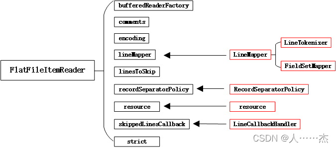
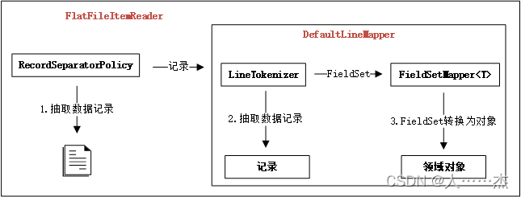

## 1 Spring Batch -- FlatFileItemReader

[Spring Batch之读数据—FlatFileItemReader（二十五）](https://blog.csdn.net/qq_21370419/article/details/122970144)

实现ItemReader接口，核心作用将**Flat文件**中的记录转换为Java对象。

>Flat File: 是一种包含没有相对关系结构的记录的文件。说白了就是不像表那样有结构，而是文本文档一样记录的数据。

### 1.1 property/该类的字段

属性|类型|说明
:-|:-|:-
bufferedReaderFactory|BufferedReaderFactory|根据给定的resource创建BufferReader实例，默认使用DefaultBufferedReaderFactory创建文本类型的BufferReader实例。
comments|String[]|定义注释行的前缀，当某行以这些字符串中的一个开头时候，此行记录将会被Spring Batch框架忽略。
encoding|String|读取文件的编码类型，默认值为从环境变量file.encoding获取，如果没有设置则默认为UTF-8
lineMapper|`LineMapper<T>`|将一行文件记录转换为Java对象
linesToSkip|int|读取文件的时候，定义跳过文件的行数；跳过的行记录将会被传递给skippedLinesCallback，执行跳过行的回调操作
recordSeparatorPolicy|RecordSeparatorPolicy|定义文件如何区分记录，可以按照单行、也可以按照多行区分记录
resource|Resource|需要读取的资源文件
skippedLinesCallback|LineCallbackHandler|定义文件中记录跳过时执行的回调操作，通常与linesToSkip一起使用
strict|boolean|定义读取文件不存在时候的策略，如果为true则抛出异常；如果为false表示不抛出异常，默认值为true

### 1.2 字段所对应的类/接口



<div style="font-weight:bold;color:red;">红色部分：</div>

关键类|说明
:-|:-
Resource|定义读取的文件资源
RecordSeparatorPolicy|从文件中确定一条记录的策略，记录可能是一行，可能是跨多行
LineMapper|将一条记录转化为Java数据对象，通常由LineTokenizer和FieldSetMapper组合来实现该功能
LineTokenizer|将一条记录分割为多个字段，在LineMapper的默认实现DefaultLineMapper中使用
FieldSetMapper|将多个字段值转化为Java对象，在LIneMapper的默认实现DefaultLineMapper中使用
LineCallbackHandler|处理文件中记录回调处理操作

### 1.3 各接口定义

#### 1.3.1 RecordSeparatorPolicy

```
//org.springframework.batch.item.file.separator.RecordSeparatorPolicy

public interface RecordSeparatorPolicy {
    //操作定义记录是否结束
    boolean isEndOfRecord(String var1);
    //操作在一个新行加入到记录前触发
    String postProcess(String var1);
    //操作在一个完整记录返回前触发
    String preProcess(String var1);
}
```

>FlatFileItemReader默认使用SimpleRecordSeparatorPolicy作为记录分割策略，即每一行作为一条记录。

#### 1.3.2 LineMapper

```
//org.springframework.batch.item.file.mapping.LineMapper

public interface LineMapper<T> {
    //传入的参数是行的内容和行号，返回值为转换后的领域对象(通常为Java对象)。
    T mapLine(String var1, int var2) throws Exception;
}
```

4个默认实现：

LineMapper|说明
:-|:-
1 `DefaultLineMapper<T>`|默认的行转换类，引用接口`LineToken<T>`和`FieldSetMapper<T>`完成数据转换；LineTokenizer负责将一条记录转换为对象FieldSet(可以看作是一个key-value对的组合)，`FieldSetMapper<T>`负责将FieldSet转换为领域对象 `DefaultLineMapper<T>` 
2 JsonLineMapper|负责将文件中JSON格式的文本数据转换为领域对象，转换后的领域对象格式为`Map<String,Object> JsonLineMapper`
3 PassThroughLineMapper|最简化的数据转换实现类，将一条记录直接返回，可以认为返回的领域对象为String类型的格式 PassThroughLineMapper
4 `PatternMatchingCompositeLineMapper<T>`|复杂数据转换类，可以为不同的记录定义不同的`LineTokenizer和FieldSetMapper<T>`来实现数据转换；在执行过程中，根据每条记录的内容根据设置的条件找到匹配的`LineTokenizer`和`FieldSetMapper<T>`进行数据转换；多用于处理同一文件中有不同类型记录的场景。可以认为`PatternMatchingCompositeLineMapper<T>`组合了多个`DefaultLineMapper<T>` `PatternMatchingCompositeLineMapper<T>`

### 1.4 LineMapper之DefaultLineMapper详解

`DefaultLineMapper<T>`是Spring Batch框架提供的一种LIneMapper实现，其默认使用
* LineTokenizer: 负责将一条记录转换为FieldSet对象
* FieldSetMapper<T>: 负责将FieldSet对象转换为领域对象

完成数据转换功能。

DefaultLineMapper通过组合的方式将任务委托给**两个接口**来完成，简化了DefaultLineMapper的代码结构，同时使得每个对象完成的任务职责非常简单，保持了代码结构清晰。



配置DefaultLineMapper的实例代码：

```
<bean:bean id="lineMapper" class="org.springframework.batch.item.file.mapping.DefaultLineMapper" >
    <bean:property name="lineTokenizer" ref="delimitedLineTokenizer" />
    <bean:property name="fieldSetMapper" ref="creditBillFieldSetMapper"/>
</bean:bean>
```

#### 1.4.1 LineTokenizer

```
public interface LineTokenizer {
    //传入的参数是行的内容，返回值为FieldSet对象。
    //FieldSet对象中可以认为是一组key-value的组合，
    //负责存放每条记录分割后的数据条目，
    //条目以key-value(key可以认为是字段的名字name)的方式存在。
    FieldSet tokenize(String var1);
}
```

>FieldSet接口中定义了读取value值的基本类型操作，以及操作name相关的方法。在FieldSet中读取value时，支持直接转换为类型String、Boolean、Char、Byte、Short、Int、Long、Float、Double、BigDecimal、Date。

**4类默认的实现：**

LineTokenizer|说明
:-|:-
DelimitedLineTokenizer|基于分隔符的行转换，根据给定的分隔符将一条记录转换为FieldSet对象org.springframework.batch.item.file.transform.DelimitedLineTokenizer
FixedLengthTokenizer|基于定长数据的行转换，根据给定的数据长度将一条记录转换为FieldSet对象org.springframework.batch.item.file.transform.FixedLengthTokenizer
RegexLineTokenizer|根据正则表达式的条件将一条记录转换为FieldSet对象org.springframework.batch.item.file.transform.RegexLineTokenizer
PatternMatchingCompositeLineTokenizer|可以为不同的记录定义不同的LineTokenizer；在执行过程中根据给定的标识与每条记录比对，如果满足则用指定的LineTokenizer；多用于处理同一文件中有不同类型记录的场场景org.springframework.batch.item.file.transform.PatternMatchingCompositeLineTokenizer

**1. DelimitedLineTokenizer: 分隔符文件配置**

例：

① 待处理的以“,”为分隔符的文件:

```
4047390012345678,tom,100.00,2013-2-2 12:00:08,Lu Jia Zui road 4047390012345678,tom,320.00,2013-2-3 10:35:21,Lu Jia Zui road 4047390012345678,tom,674.70,2013-2-6 16:26:49,South Linyi road 4047390012345678,tom,793.20,2013-2-9 15:15:37,Longyang road 4047390012345678,tom,360.00,2013-2-11 11:12:38,Longyang road 4047390012345678,tom,893.00,2013-2-28 20:34:19,Hunan road
```

② 配置分隔符DelimitedLineTokenizer：

```
<bean:bean id="lineTokenizer" class="org.springframework.batch.item.file.transform.DelimitedLineTokenizer">
    <bean:property name="delimiter" value=","/>
    <bean:property name="names">
        <bean:list>
            <bean:value>accountID</bean:value>
            <bean:value>name</bean:value>
            <bean:value>amount</bean:value>
            <bean:value>date</bean:value>
            <bean:value>address</bean:value>
        </bean:list>
    </bean:property>
</bean:bean>
```

* delimiter：表示分隔符为“,”。
* names：为每个字段定义名字，根据分隔符“,”获取的每个字段值分别对应names中定义的名字。

**2. FixedLengthTokenizer: 定长类型文件处理**

例：

① 如下是定长文件，每行记录长度一致，字段间不足的使用空格补齐，每个字段的固定长度为1-16，17-26,27-34,35-53,54-72：

```
4041390012345678tom       00100.002013-02-02 12:00:08    Lu Jia Zui road
4042390012345678tom       00320.002013-02-03 10:35:21    Lu Jia Zui road
4043390012345678jerry     00674.702013-02-06 16:26:49   South Linyi road
4044390012345678rose      00793.202013-02-09 15:15:37      Longyang road
4045390012345678bruce     00360.002013-02-11 11:12:38      Longyang road
4046390012345678rachle    00893.002013-02-28 20:34:19         Hunan road
```

② 配置定长文件FixedLengthTokenizer：

```
<bean:bean id="fixedLengthLineTokenizer" class="org.springframework.batch.item.file.transform.FixedLengthTokenizer">
    <bean:property name="columns" value="1-16,17-26,27-34,35-53,54-72"/>
    <bean:property name="names" value="accountID,name,amount,date,address"/> 
</bean:bean>
```

* columns：定义字段长度，字段顺序和names定义的名字匹配。
* names：属性names为每个字段定义名字。

说明：定义字段长度时，从1开始，而不是从0开始。

#### 1.4.2 FieldSetMapper

```
public interface FieldSetMapper<T> {
    //传入的参数是FieldSet对象，返回值为转换后的领域对象。
    T mapFieldSet(FieldSet var1) throws BindException;
}
```

**3类默认的实现：**

FieldSetMapper|说明
:-|:-
ArrayFieldSetMapper|将FieldSet对象转换为为String[] org.springframework.batch.item.file.mapping.ArrayFieldSetMapper
BeanWrapperFieldSetMapper<T>|将FieldSet对象根据名字映射到给定的Bean中，需要保证FieldSet中的name和Bean中属性的名称一致. org.springframework.batch.item.file.mapping.BeanWrapperFieldSetMapper<T>
PassThroughFieldSetMapper|直接返回FieldSet对象. org.springframework.batch.item.file.mapping.PassThroughFieldSetMapper

**1 BeanWrapperFieldSetMapper**

BeanWrapperFieldSetMapper提供了一种方便的方式，将FieldSet对象根据名字直接映射成领域对象。如果声明使用BeanWrapperFieldSetMapper，只需要在属性prototypeBeanName中指明需要映射的领域对象即可，在运行期自动将FieldSet中name与领域对象同名的属性进行赋值操作。

**配置信息：**

```
<bean:bean id="creditBillBeanWrapperFieldSetMapper" class="org.springframework.batch.item.file.mapping.BeanWrapperFieldSetMapper" >
    <bean:property name="prototypeBeanName" value="creditBill" />
</bean:bean>
<bean:bean id="creditBill" scope="prototype" class="com.juxtapose.example.ch06.CreditBill">
</bean:bean>
```

**其中CreditBill.java：**

```
public class CreditBill implements Serializable{

   private static final long serialVersionUID = -4940717436114184875L;
   private String accountID = ""; /** 银行卡账户ID */
   private String name = "";     /** 持卡人姓名 */
   private double amount = 0;    /** 消费金额 */
   private String date;         /** 消费日期 ，格式YYYY-MM-DD HH:MM:SS*/
   private String address;          /** 消费场所 **/
}
```

**2 自定义FieldSetMapper**

直接实现接口FieldSetMapper，可以实现自定义的转换器，

```
public class CreditBillFieldSetMapper implements FieldSetMapper<CreditBill> {
 
	public CreditBill mapFieldSet(FieldSet fieldSet) throws BindException {
		CreditBill result = new CreditBill();
		result.setId(fieldSet.readString("id"));
		result.setAccountID(fieldSet.readString("accountID"));
		result.setName(fieldSet.readString("name"));
		result.setAmount(fieldSet.readDouble("amount"));
		result.setDate(fieldSet.readString("date"));
		result.setAddress(fieldSet.readString("address"));
		return result;
	}
}

//配置

<bean:bean id="creditBillFieldSetMapper" class="com.juxtapose.example.ch06.flat.CreditBillFieldSetMapper">
</bean:bean>
```

### 1.5 LineCallbackHandler

>在FlatFileItemReader中定义属性linesToSkip，表示从文件头开始跳过指定的行；当记录被跳过时，会触发接口LineCallbackHander中的handleLine()操作，该操作中能够获取跳过的行内容。

经常使用的场景是将Falt文件中的文件头跳过后，然后将跳过的文件头内容直接写到目标文件的文件头中，这可以通过实现LineCallbcckHandler接口来完成。

`LineCallbackHandler`接口定义如下：

```
public interface LineCallbackHandler {
    //每次跳过时均会被触发
    void handleLine(String var1);
}
```

#### 1.5.1 自定义实现LineCallbackHandler

实现接口LineCallbackHandler，将跳过的文件内容写入到目标文件中：

```
public class CopyHeaderLineCallbackHandler implements LineCallbackHandler, FlatFileHeaderCallback {
    private String header = "";

    //负责收集读文件跳过的头记录
    public void handleLine(String line) {
        this.header = line;
    }

    //负责写入到目标文件中
    public void writeHeader(Writer writer) throws IOException {
        writer.write(header);
    }
}
```

其中，接口FlatFileHeaderCallback用于定义在ItemWrite之前写入特定的文件头，主要的操作是writeHeader().

配置信息：

```
<bean:bean id="copyHeaderItemReader" scope="step" class="org.springframework.batch.item.file.FlatFileItemReader">
    <bean:property name="resource" value="classpath:ch06/data/flat/credit-card-bill-201303-complex.csv"/>
    <bean:property name="lineMapper" ref="lineMapper" />
    <bean:property name="linesToSkip" value="1"/>
    <bean:property name="skippedLinesCallback" ref="copyHeaderLineCallbackHandler"/>
    .........
</bean:bean>
<bean:bean id="copyHeaderLineCallbackHandler" class="com.juxtapose.example.ch06.flat.CopyHeaderLineCallbackHandler">
</bean:bean>
<bean:bean id="csvItemWriter" class="org.springframework.batch.item.file.FlatFileItemWriter" scope="step">
    <bean:property name="resource" value="file:target/ch06/copyheader/outputFile.csv"/>
    <bean:property name="headerCallback" ref="copyHeaderLineCallbackHandler"/>
    .........
</bean:bean>
```