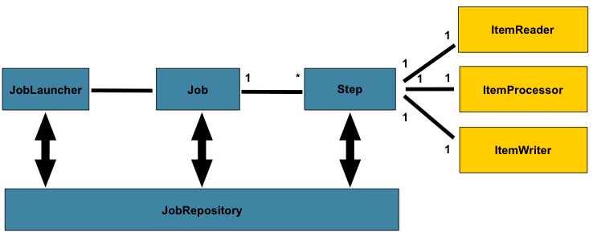
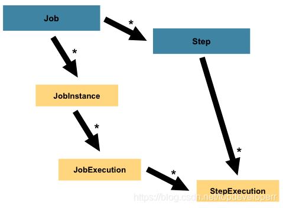
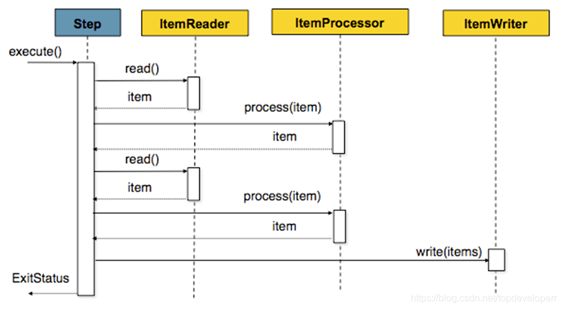

## 1 spring batch

[批处理框架 `spring batch` 这么强，你会用吗？](http://news.sohu.com/a/523994220_121124363)

一个典型的批处理应用程序大致如下：

* 读：从数据库，文件或队列中读取大量记录。
* 处理：以某种方式处理数据。
* 写：以修改之后的形式写回数据。

其对应的示意图如下：

`spring batch`的一个总体的架构如下：



在`spring batch`中一个job可以定义很多的步骤step，

在每一个step里面可以定义其专属的
* ItemReader用于读取数据，
* ItemProcesseor用于处理数据，
* ItemWriter用于写数据，

而每一个定义的job则都在JobRepository里面，

我们可以通过JobLauncher来启动某一个job。

### 1.1 Job

>`Job`和`Step`是`spring batch`执行批处理任务最为核心的两个概念。

Job是一个封装整个批处理过程的一个概念。Job在`spring batch`的体系当中只是一个最顶层的一个抽象概念，体现在代码当中则它只是一个最上层的接口，其代码如下:

```
/** 
* Batch domain object representing a job. Job is an explicit abstraction 
* representing the configuration of a job specified by a developer. It should 
* be noted that restart policy is applied to the job as a whole and not to a 
* step. 
*/ 
public interface Job{ 
    String getName( ) ; 
    boolean isRestartable( ) ; 
    void execute( JobExecution execution) ; 
    JobParametersIncrementer getJobParametersIncrementer( ) ; 
    JobParametersValidator getJobParametersValidator( ) ; 
}
```

在Job这个接口当中定义了五个方法，它的实现类主要有两种类型的job，
* 一个是`simplejob`，
* 另一个是`flowjob`。

>在spring batch当中，job是最顶层的抽象，除job之外我们还有`JobInstance`以及`JobExecution`这两个更加底层的抽象。

一个job是我们运行的基本单位，它内部由step组成。job本质上可以看成step的一个容器。

一个job可以按照指定的逻辑顺序组合step，并提供了我们给所有step设置相同属性的方法，例如一些事件监听，跳过策略。

Spring Batch以**SimpleJob类**的形式提供了Job接口的**默认简单实现**，它在Job之上创建了一些标准功能。

一个使用java config的例子代码如下：

```
@Bean 
public Job footballJob { 
    return this.jobBuilderFactory.get("footballJob") 
    .start(playerLoad) 
    .next(gameLoad) 
    .next(playerSummarization) 
    .end 
    .build; 
}
```

这个配置的意思是：首先给这个job起了一个名字叫footballJob，接着指定了这个job的三个step，他们分别由方法:
* playerLoad,
* gameLoad, 
* playerSummarization

实现。

#### 1.1.1 JobInstance

在上文已经提到了JobInstance，他是Job的更加底层的一个抽象，他的定义如下：

```
public interface JobInstance { 
    /** 
    * Get unique id for this JobInstance. 
    * @return instance id 
    */ 
    public long getInstanceId; 
    /** 
    * Get job name. 
    * @return value of 'id' attribute from <job> 
    */ 
    public String getJobName; 
}
```

方法很简单，一个是返回Job的id，另一个是返回Job的名字。

JobInstance指的是job运行当中，作业执行过程当中的概念。Instance本就是实例的意思。

比如说现在有一个批处理的job，它的功能是在一天结束时执行行一次。我们假定这个批处理job的名字为'EndOfDay'。在这个情况下，那么每天就会有一个逻辑意义上的JobInstance, 而我们必须记录job的每次运行的情况。

#### 1.1.2 JobParameters

在上文当中我们提到了，同一个job每天运行一次的话，那么每天都有一个jobIntsance，但他们的job定义都是一样的，那么我们怎么来区别一个job的不同jobinstance了。

不妨先做个猜想，虽然jobinstance的job定义一样，但是他们有的东西就不一样，例如运行时间。

因此，我们可以通过把运行时间当作Jobparameter来操作正确的JobInstance。

#### 1.1.3 JobExecution

`JobExecution`指的是单次尝试运行一个我们定义好的Job的代码层面的概念。

job的一次执行可能以失败也可能成功。只有当执行成功完成时，给定的`JobExecution`与执行相对应的JobInstance才也被视为完成。

还是以前面描述的EndOfDay的job作为示例，假设第一次运行01-01-2019的JobInstance结果是失败。那么此时如果使用与第一次运行相同的Jobparameter参数（即01-01-2019）作业参数再次运行，那么就会创建一个对应于之前jobInstance的一个新的JobExecution实例,JobInstance仍然只有一个。

JobExecution的接口定义如下：

```
public interface JobExecution{
    /** * Get unique id for this JobExecution. * @return execution id */
    public longget ExecutionId( ) ;
    /** * Get job name. * @return value of 'id' attribute from <job> */
    public String getJobName( ) ;
    /** * Get batch status of this execution. * @return batch status value. */
    public BatchStatus getBatchStatus( ) ;
    /** * Get time execution entered STARTED status. * @return date (time) */
    public Date getStartTime( ) ;
    /** * Get time execution entered end status: COMPLETED, STOPPED, FAILED * @return date (time) */
    public Date getEndTime( ) ;
    /** * Get execution exit status. * @return exit status. */
    public String getExitStatus( ) ;
    /** * Get time execution was created. * @return date (time) */
    public Date getCreateTime( ) ;
    /** * Get time execution was last updated updated. * @return date (time) */
    public Date getLastUpdatedTime( ) ;
    /** * Get job parameters for this execution. * @return job parameters */
    public Properties getJobParameters( ) ;
}
```

只提一下BatchStatus，JobExecution当中提供了一个方法`getBatchStatus`用于获取一个job某一次特地执行的一个状态。

BatchStatus是一个代表job状态的枚举类，其定义如下：

```
public enum BatchStatus{ 
    STARTING, STARTED, STOPPING, STOPPED, FAILED, COMPLETED, ABANDONED
}
```

这些属性对于一个job的执行来说是非常关键的信息，并且spring batch会将他们持久到数据库当中. 在使用Spring batch的过程当中spring batch会自动创建一些表用于存储一些job相关的信息，用于存储JobExecution的表为`batch_job_execution`。

### 1.2 Step

每一个Step对象都封装了批处理作业的一个独立的阶段。事实上，每一个Job本质上都是由一个或多个步骤组成。每一个step包含定义和控制实际批处理所需的所有信息。任何特定的内容都由编写Job的开发人员自行决定。

一个step可以非常简单也可以非常复杂。例如，一个step的功能是将文件中的数据加载到数据库中，那么基于现在spring batch的支持则几乎不需要写代码。更复杂的step可能具有复杂的业务逻辑，这些逻辑作为处理的一部分。

与Job一样，Step具有与JobExecution类似的StepExecution，如下图所示：



#### 1.2.1 StepExecution

StepExecution表示一次执行Step, 每次运行一个Step时都会创建一个新的StepExecution，类似于JobExecution。但是，某个步骤可能由于其之前的步骤失败而无法执行。且仅当Step实际启动时才会创建StepExecution。

一次step执行的实例由StepExecution类的对象表示。每个StepExecution都包含对其相应步骤的引用以及JobExecution和事务相关的数据，例如提交和回滚计数以及开始和结束时间。

此外，每个步骤执行都包含一个ExecutionContext，其中包含开发人员需要在批处理运行中保留的任何数据，例如重新启动所需的统计信息或状态信息。

#### 1.2.2 ExecutionContext

ExecutionContext即每一个StepExecution 的执行环境。它包含一系列的键值对。我们可以用如下代码获取ExecutionContext:

```
ExecutionContextecStep = stepExecution.getExecutionContext; 
ExecutionContextecJob = jobExecution.getExecutionContext;
```

### 1.3 JobRepository

JobRepository是一个用于将上述job，step等概念进行持久化的一个类。它同时给Job和Step以及下文会提到的JobLauncher实现提供CRUD操作。

首次启动Job时，将从repository中获取JobExecution，并且在执行批处理的过程中，StepExecution和JobExecution将被存储到repository当中。

`@EnableBatchProcessing`注解可以为JobRepository提供自动配置。

### 1.4 JobLauncher

JobLauncher这个接口的功能非常简单，它是用于启动指定了JobParameters的Job，为什么这里要强调指定了JobParameter，原因其实我们在前面已经提到了，jobparameter和job一起才能组成一次job的执行。

```
public interface JobLauncher{ 
    public JobExecution run(Job job, JobParameters jobParameters) 
        throws JobExecutionAlreadyRunningException, 
        JobRestartException, 
        JobInstanceAlreadyCompleteException, 
        JobParametersInvalidException; 
}
```

上面run方法实现的功能是根据传入的job以及jobparamaters从JobRepository获取一个JobExecution并执行Job。

### 1.5 Item Reader

ItemReader是一个读数据的抽象，它的功能是为每一个Step提供数据输入。

当ItemReader以及读完所有数据时，它会返回null来告诉后续操作数据已经读完。

Spring Batch为ItemReader提供了非常多的有用的实现类，比如`JdbcPagingItemReader`，`JdbcCursorItemReader`等等。

ItemReader支持的读入的数据源也是非常丰富的，包括各种类型的数据库，文件，数据流，等等。几乎涵盖了我们的所有场景。

**下面是一个JdbcPagingItemReader的例子代码：**

```
@Bean 
public JdbcPagingItemReader itemReader(DataSource dataSource, PagingQueryProvider queryProvider) {
    Map< String, Object> parameterValues = new HashMap<>();
    parameterValues.put( "status", "NEW");
    return new JdbcPagingItemReaderBuilder<CustomerCredit> ()
        .name( "creditReader") 
        .dataSource(dataSource) 
        .queryProvider(queryProvider) 
        .parameterValues(parameterValues) 
        .rowMapper(customerCreditMapper) 
        .pageSize( 1000) 
        .build;
}
@Bean 
public SqlPagingQueryProviderFactoryBean queryProvider {
    SqlPagingQueryProviderFactoryBean provider = new SqlPagingQueryProviderFactoryBean();
    provider.setSelectClause( "select id, name, credit");
    provider.setFromClause( "from customer");
    provider.setWhereClause( "where status=:status");
    provider.setSortKey( "id");
    return provider;
}
```

JdbcPagingItemReader必须指定一个PagingQueryProvider，负责提供SQL查询语句来按分页返回数据。

**下面是一个JdbcCursorItemReader的例子代码:**

```
private JdbcCursorItemReader< Map< String, Object>> buildItemReader(final DataSource dataSource, StringtableName, Stringtenant) {
    JdbcCursorItemReader< Map< String, Object>> itemReader = new JdbcCursorItemReader<>();
    itemReader.setDataSource(dataSource);
    itemReader.setSql( "sql here");
    itemReader.setRowMapper( newRowMapper);
    return itemReader;
}
```

### 1.6 Item Processor

ItemProcessor对项目的业务逻辑处理的一个抽象, 当ItemReader读取到一条记录之后，ItemWriter还未写入这条记录之前，我们可以借助ItemProcessor提供一个处理业务逻辑的功能，并对数据进行相应操作。

如果我们在ItemProcessor发现一条数据不应该被写入，可以通过返回null来表示。ItemProcessor和ItemReader以及ItemWriter可以非常好的结合在一起工作，他们之间的数据传输也非常方便。我们直接使用即可。

### 1.7 Item Writer

既然ItemReader是读数据的一个抽象，那么ItemWriter自然就是一个写数据的抽象，它是为每一个step提供数据写出的功能。写的单位是可以配置的，我们可以一次写一条数据，也可以一次写一个chunk的数据，关于chunk下文会有专门的介绍。ItemWriter对于读入的数据是不能做任何操作的。

Spring Batch为ItemWriter也提供了非常多的有用的实现类，当然我们也可以去实现自己的writer功能。

### 1.8 chunk 处理流程

spring batch提供了让我们按照chunk处理数据的能力，一个chunk的示意图如下：



所图所示，由于我们一次batch的任务可能会有很多的数据读写操作，因此一条一条的处理并向数据库提交的话效率不会很高，因此spring batch提供了chunk这个概念，我们可以设定一个chunk size，spring batch 将一条一条处理数据，但不提交到数据库，只有当处理的数据数量达到chunk size设定的值的时候，才一起去commit.

java的实例定义代码如下：

```
@Bean
public Job sampleJob(){
    return this.jobBuilderFactory.get("sampleJob")
        .start(step1())
        .end()
        .build();
}

@Bean
public Step step1() {
    return this. stepBuilderFactory.get ("step1")
        .<String, String>chunk(10)
        .reader(itemReader())
        .writer(itemWriter())
        .build();
}
```

在上面这个step里面，chunk size被设为了10，当ItemReader读的数据数量达到10的时候，这一批次的数据就一起被传到itemWriter，同时transaction被提交。

### 1.9 skip策略和失败处理

一个batch的job的step，可能会处理非常大数量的数据，难免会遇到出错的情况，出错的情况虽出现的概率较小，但是我们不得不考虑这些情况，因为我们做数据迁移最重要的是要保证数据的最终一致性。

spring batch当然也考虑到了这种情况，并且为我们提供了相关的技术支持，请看如下bean的配置：

```
@Bean
public Step step1() {
    return this. stepBuilderFactory.get("step1")
        .<String, String>chunk(10)
        .reader(flatFileItemReader())
        .writer(itemwriter())
        .faultTolerant()
        .skipLimit(10)
        .skip(Exception.class)
        .noSkip(FileNotFoundException.class)
        .build();
```

我们需要留意这三个方法，分别是:

* skipLimit: 意思是我们可以设定一个我们允许的这个step可以跳过的异常数量，假如我们设定为10，则当这个step运行时，只要出现的异常数目不超过10，整个step都不会fail。注意，若不设定skipLimit，则其默认值是0.
* skip: 我们可以指定我们可以跳过的异常，因为有些异常的出现，我们是可以忽略的。
* noSkip: 指出现这个异常我们不想跳过，也就是从skip的所有exception当中排除这个exception，从上面的例子来说，也就是跳过所有除FileNotFoundException的exception。

那么对于这个step来说，FileNotFoundException就是一个fatal的exception，抛出这个exception的时候step就会直接fail。

### 1.10 批处理操作指南

一些使用spring batch时的值得注意的点

#### 1.10.1 批处理原则

* 在构建批处理解决方案时，应考虑以下关键原则和注意事项。
* 批处理体系结构通常会影响体系结构
* 尽可能简化并避免在单批应用程序中构建复杂的逻辑结构
* 保持数据的处理和存储在物理上靠得很近（换句话说，将数据保存在处理过程中）。
* 最大限度地减少系统资源的使用，尤其是I / O. 在internal memory中执行尽可能多的操作。
* 查看应用程序I / O（分析SQL语句）以确保避免不必要的物理I / O. 特别是，需要寻找以下四个常见缺陷：
* 当数据可以被读取一次并缓存或保存在工作存储中时，读取每个事务的数据。
* 重新读取先前在同一事务中读取数据的事务的数据。
* 导致不必要的表或索引扫描。
* 未在SQL语句的WHERE子句中指定键值。
* 在批处理运行中不要做两次一样的事情。例如，如果需要数据汇总以用于报告目的，则应该（如果可能）在最初处理数据时递增存储的总计，因此您的报告应用程序不必重新处理相同的数据。
* 在批处理应用程序开始时分配足够的内存，以避免在此过程中进行耗时的重新分配。
* 总是假设数据完整性最差。插入适当的检查和记录验证以维护数据完整性。
* 尽可能实施校验和以进行内部验证。例如，对于一个文件里的数据应该有一个数据条数纪录，告诉文件中的记录总数以及关键字段的汇总。
* 在具有真实数据量的类似生产环境中尽早计划和执行压力测试。
* 在大批量系统中，数据备份可能具有挑战性，特别是如果系统以24-7在线的情况运行。数据库备份通常在在线设计中得到很好的处理，但文件备份应该被视为同样重要。如果系统依赖于文件，则文件备份过程不仅应该到位并记录在案，还应定期进行测试。

#### 1.10.2 如何默认不启动job

在使用java config使用spring batch的job时，如果不做任何配置，项目在启动时就会默认去跑我们定义好的批处理job。那么如何让项目在启动时不自动去跑job呢？

spring batch的job会在项目启动时自动run，如果我们不想让他在启动时run的话，可以在application.properties中添加如下属性：

`spring.batch.job.enabled= false`

在读数据时内存不够

在使用spring batch做数据迁移时，发现在job启动后，执行到一定时间点时就卡在一个地方不动了，且log也不再打印，等待一段时间之后，得到如下错误：

```
红字的信息为：Resource exhaustion event：the JVM was unable to allocate memory from the heap.
```

翻译过来的意思就是项目发出了一个资源耗尽的事件，告诉我们java虚拟机无法再为堆分配内存。

造成这个错误的原因是: 这个项目里的batch job的reader是一次性拿回了数据库里的所有数据，并没有进行分页，当这个数据量太大时，就会导致内存不够用。解决的办法有两个:

* 调整reader读数据逻辑，按分页读取，但实现上会麻烦一些，且运行效率会下降
* 增大service内存

### 1.11 @stepScope

[Spring Batch中@StepScope的适用范围及理解](https://blog.csdn.net/lovepeacee/article/details/116003392)

先说一下IOC容器中几种bean的作用范围(scope):

1. singleton: 全局有且仅有一个实例
2. prototype: 每次获取Bean的时候会有一个新的实例
3. request: request表示该针对每一次HTTP请求都会产生一个新的bean，同时该bean仅在当前HTTP request内有效
4. session: session作用域表示该针对每一次HTTP请求都会产生一个新的bean，同时该bean仅在当前HTTP session内有效
5. globalsession: global session作用域类似于标准的HTTP Session作用域，不过它仅仅在基于portlet的web应用中才有意义

使用Spring Batch批处理框架时,batch框架中**特有的bean作用范围**注解`@StepScope`，

>xml配置为`<bean ... scope="step">`

Spring batch框架只有在批处理时才需要实例化job以及对应的最底层处理单位(reader,processor,writer,tasklet)

而job启动后的运行参数一旦确定便无法修改。

为了使每一次启动job时使处理单位的参数可以动态修改(比如第一次job启动时参数`tranDate="20210101"`,第二次job参数启动时参数改为`tranDate="20210102"`).

所以设计了`@StepScope`配合`@Value("#{jobParameters['contractInfoDat']}")` 从job的启动参数中获取所需参数。

* `@StepScope`只能用在最底层处理单位(reader,processor,writer,tasklet)的方法上,配合@Bean使用。
* 被@StepScope注解修饰的bean只会在step启动时进行初始化,step处理完成后便会被销毁,即同一个Step执行两次你会发现Writer创建了两次。