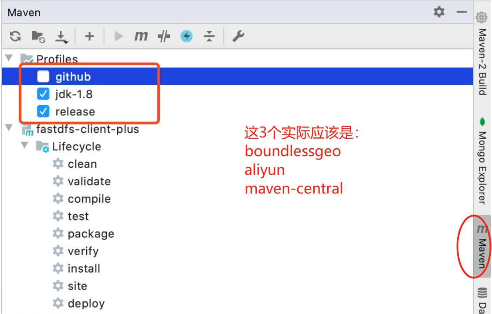

# 多仓库配置

参考：[maven仓库中心mirrors配置](https://www.cnblogs.com/gentlescholar/p/15049090.html)

## 1 依赖寻找仓库的顺序

1. 访问本地仓库

2. 国内访问maven默认远程中央镜像特别慢；

3. 使用阿里的镜像替代远程中央镜像；

4. 阿里云镜像中缺少部分jar包；

5. 同时使用私有仓库和公有仓库；

针对以上情况，我们就需要让Maven支持多仓库配置。

## 2 全局多仓库配置

配置写在`settings.xml`中

### 2.1 mirror标签说明

从上一小节，如果要下载依赖时，默认从中央仓库下载，但速度太慢，我们选择阿里的镜像代替中央仓库，如下：

```
<mirrors>
    <mirror>
        <id>alimaven</id>
        <name>aliyun maven</name>
        <url>http://maven.aliyun.com/nexus/content/groups/public/</url>
        <mirrorOf>central</mirrorOf>
    </mirror>
</mirrors>
```

镜像配置说明：

1. id: 镜像的唯一标识；

2. name: 名称描述；

3. url: 远程仓库地址；

4. mirrorOf: 指定镜像规则，什么情况下从镜像仓库拉取。其中，
    * `*`: 匹配所有，所有内容都从镜像拉取；
    * `external:*`: 除了本地缓存的所有从镜像仓库拉取；
    * `repo,repo1`: repo或者repo1，这里的repo指的`repository`标签的id；
    * `*,!repo1`: 除了repo1的所有仓库；

>如果仅在这配置多个镜像，其它全是默认设置，那么在项目寻找依赖的仓库时，默认选择第1个符合要求的仓库：
>1. 如果没有配置镜像，则默认从中央仓库下载依赖
>2. 如果配置了镜像，则在配置的镜像中从上往下寻找第一个镜像(动词)了中央仓库的仓库
>   mirrorOf为`*`或`central`的镜像配置
>
>其余下方配置再多镜像也不起作用。

### 2.2 多仓库配置(profile与激活使用)

**Ⅰ：profiles**

每一个`profile`标签都是一个仓库池的集中配置，重点关注其中的`repositories`标签：

```
<profiles>
    <profile>
      <id>boundlessgeo</id> 
      <repositories>
        <repository>
          <id>boundlessgeo</id> 
          <url>https://repo.boundlessgeo.com/main/</url> 
          <releases>
            <enabled>true</enabled>
          </releases> 
          <snapshots>
            <enabled>true</enabled> 
            <updatePolicy>always</updatePolicy>
          </snapshots>
        </repository>
      </repositories>
    </profile>
    <profile>
      <id>aliyun</id> 
      <repositories>
        <repository>
          <id>aliyun</id> 
          <url>http://maven.aliyun.com/nexus/content/groups/public/</url> 
          <releases>
            <enabled>true</enabled>
          </releases> 
          <snapshots>
            <enabled>true</enabled> 
            <updatePolicy>always</updatePolicy>
          </snapshots>
        </repository>
      </repositories>
    </profile> 
    <profile>
      <id>maven-central</id> 
      <repositories>
        <repository>
          <id>maven-central</id> 
          <url>http://central.maven.org/maven2/</url> 
          <releases>
            <enabled>true</enabled>
          </releases> 
          <snapshots>
            <enabled>true</enabled> 
            <updatePolicy>always</updatePolicy>
          </snapshots>
        </repository>
      </repositories>
    </profile>
<profiles>
```

**Ⅱ：激活profiles**

```
<activeProfiles>
    <activeProfile>boundlessgeo</activeProfile>
    <activeProfile>aliyun</activeProfile>
    <activeProfile>maven-central</activeProfile>
</activeProfiles>
```

**Ⅲ：idea里的maven使用**

在idea中配置本地maven的settings.xml后，可以看到：



## 3 项目中单独多仓库配置

一般写在父`pom.xml`中。

实际上就是上一小节中`profiles`中的`repositories`标签。

```
<!-- 额外依赖的其它maven仓库 -->
<repositories>
    <repository>
        <id>central-repo1</id>
        <name>Maven Repository Switchboard</name>
        <url>http://repo1.maven.org/maven2/</url>
        <layout>default</layout>
        <releases>
            <enabled>true</enabled>
        </releases>
    </repository>
</repositories>
```

>如果配完不起作用，建议mvn clean、再删除本地仓库中之前错误下载的依赖版本、再重启idea。
>反正就是有些莫明其妙的问题。