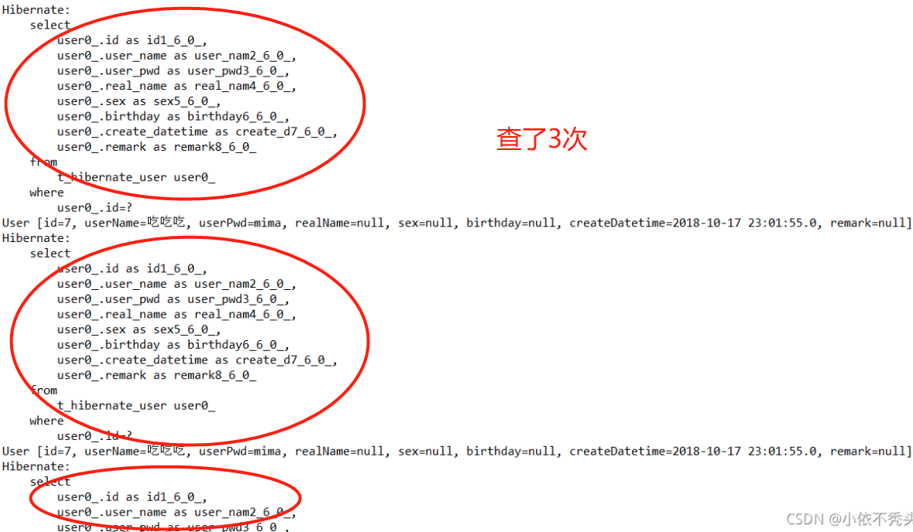
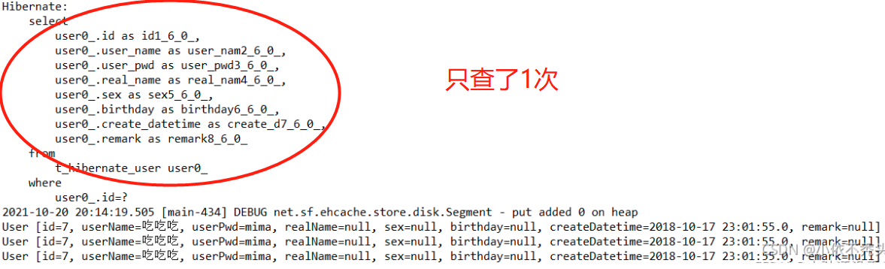

# Hibernate之二级缓存

参考：[Hibernate之二级缓存](https://blog.csdn.net/qq_54936371/article/details/121391967)

---

## 1 缓存介绍

缓存：拉高程序的性能

### 1.1 数据库与缓存

#### 1.1.1 数据库分类

* **关系型数据库**：数据与数据之间存在关系（联系）的数据库

    * mysql
    * Oracle
    * sqlserver

* **非关系型数据库**：数据与数据之间是不存在关系的------以键值对的形式存在

    * 基于**文件**存储的数据库：ehcache
    * 基于**内存**存储的数据库：redis,memcache
    * 基于**文档**存储的数据库：mongodb

#### 1.1.2 可用作缓存的数据库

基本上都使用**非关系型数据库**作为缓存。

#### 1.1.3 缓存保存哪些数据

根本不修改或很少被修改的数据，但这类数据又被频繁查询。（**数据字典**存储）

#### 1.1.4 数据字典

一个项目中所有的基础数据，比如项目中的所有下拉框/菜单之类的数据。

表设计：

* 数据源表：数据源标识，数据源描述
* 数据项表：数据源标识，数据项键，数据值
    * (cacheName, cache(cacheKey,cacheValue))

解决的问题：避免了动不动就建很多表的情况


### 1.2 ehcache作为缓存

Ehcache是现在最流行的纯Java开源缓存框架，配置简单，结构清晰，功能强大。

#### 1.2.1 导入相关依赖

```
<dependency>
    <groupId>net.sf.ehcache</groupId>
    <artifactId>ehcache</artifactId>
    <version>2.10.0</version>
</dependency>
```
  
#### 1.2.2 核心概念

* CacheManager：缓存管理器
* Cache：缓存对象，缓存管理器内可以放置若干cache，存放数据的介质（所有cache都实现了Ehcache接口）
* Element：单条缓存数据的组成单位

#### 1.2.3 配置文件：ehcache.xml

## 2 hibernate缓存

hibernate可分为：

1. 一级缓存：session
2. 二级缓存：SessionFactory（可拔插式）

### 2.1 导入ehcache相关依赖

```
<dependency>
    <groupId>org.hibernate</groupId>
    <artifactId>hibernate-ehcache</artifactId>
    <version>5.2.12.Final</version>
</dependency>
```

### 2.2 添加ehcache.xml

```
<?xml version="1.0" encoding="UTF-8"?>
<ehcache xmlns:xsi="http://www.w3.org/2001/XMLSchema-instance"
         xsi:noNamespaceSchemaLocation="http://ehcache.org/ehcache.xsd"
         updateCheck="false">
    <!--磁盘存储:将缓存中暂时不使用的对象,转移到硬盘,类似于Windows系统的虚拟内存-->
    <!--path:指定在硬盘上存储对象的路径-->
    <!--java.io.tmpdir 是默认的临时文件路径。 可以通过如下方式打印出具体的文件路径 System.out.println(System.getProperty("java.io.tmpdir"));-->
    <diskStore path="D://xxx"/>
 
 
    <!--defaultCache：默认的管理策略-->
    <!--eternal：设定缓存的elements是否永远不过期。如果为true，则缓存的数据始终有效，如果为false那么还要根据timeToIdleSeconds，timeToLiveSeconds判断-->
    <!--maxElementsInMemory：在内存中缓存的element的最大数目-->
    <!--overflowToDisk：如果内存中数据超过内存限制，是否要缓存到磁盘上-->
    <!--diskPersistent：是否在磁盘上持久化。指重启jvm后，数据是否有效。默认为false-->
    <!--timeToIdleSeconds：对象空闲时间(单位：秒)，指对象在多长时间没有被访问就会失效。只对eternal为false的有效。默认值0，表示一直可以访问-->
    <!--timeToLiveSeconds：对象存活时间(单位：秒)，指对象从创建到失效所需要的时间。只对eternal为false的有效。默认值0，表示一直可以访问-->
    <!--memoryStoreEvictionPolicy：缓存的3 种清空策略-->
    <!--FIFO：first in first out (先进先出)-->
    <!--LFU：Less Frequently Used (最少使用).意思是一直以来最少被使用的。缓存的元素有一个hit 属性，hit 值最小的将会被清出缓存-->
    <!--LRU：Least Recently Used(最近最少使用). (ehcache 默认值).缓存的元素有一个时间戳，当缓存容量满了，而又需要腾出地方来缓存新的元素的时候，那么现有缓存元素中时间戳离当前时间最远的元素将被清出缓存-->
    <defaultCache eternal="false" maxElementsInMemory="1000" overflowToDisk="false" diskPersistent="false"
                  timeToIdleSeconds="0" timeToLiveSeconds="600" memoryStoreEvictionPolicy="LRU"/>
 
 
    <!--name： Cache的名称，必须是唯一的(ehcache会把这个cache放到HashMap里)-->
    <cache name="com.javaxl.one.entity.User" eternal="false" maxElementsInMemory="100"
           overflowToDisk="false" diskPersistent="false" timeToIdleSeconds="0"
           timeToLiveSeconds="300" memoryStoreEvictionPolicy="LRU"/>
</ehcache>
```

### 2.3 hibernate.cfg.xml中添加二级缓存相关配置

```
<!-- 开启二级缓存 -->
<property name="hibernate.cache.use_second_level_cache">true</property>
<!-- 开启查询缓存 -->
<property name="hibernate.cache.use_query_cache">true</property>
<!-- EhCache驱动 -->
<property name="hibernate.cache.region.factory_class">org.hibernate.cache.ehcache.EhCacheRegionFactory</property>
```

### 2.4 指定实体类开启二级缓存

```
<!-- 注解式开发 -->
<class-cache usage="read-write" class="entity.Dict"/>

<!-- xml配置方式 -->
<class table="t_sys_dict" name="entity.Dict">
    <!-- 这里的region指的是Ehcache.xml中cacheName -->
    <cache usage="read-write" region="com.zking.one.entity.User"/> 
    .......
</class>
```

>注意：hibernate二级缓存不会同时缓存多条数据，若想查询同一张表的多条记录，需要通过编写代码来开启二级缓存：
>query.setCacheRegion("entity.Dict");//指定缓存策略，名字必须实体类的完整类名
>query.setCacheable(true);//手动开启二级缓存

## 3 测试二级缓存的使用

### 3.0 测试代码

```

/**
 * 演示查单个用户使用了缓存
 * @author Administrator
 *
 */
public class EhcacheDemo3 {
    /**
     * sql语句只生成一次，因为是同一个session，且只查了同一条记录，即用到了一级缓存
     */
    @Test
        public void test1() {
        Session session = SessionFactoryUtil.getSession();
        Transaction transaction = session.beginTransaction();
        User user = session.get(User.class, 7);
        System.out.println(user);
        User user2 = session.get(User.class, 7);
        System.out.println(user2);
        User user3 = session.get(User.class, 7);
        System.out.println(user3);
        transaction.commit();
        session.close();
    }
    /**
    * 默认情况下，sql语句形成了三次，每一次运行的都是new的一个userdao，每次都新建了session
    * 因此这里为了提高性能，后面必须使用二级缓存SessionFactory缓存
    */
    @Test
        public void test2() {
        UserDao userDao  = new UserDao();
        User u = new User();
        u.setId(7);
        User user = userDao.get(u);     //第1次
        System.out.println(user);
        User user2 = userDao.get(u);    //第2次
        System.out.println(user2);
        User user3 = userDao.get(u);    //第3次
        System.out.println(user3);
    }
}
```

### 3.1 不开二级缓存的结果

* test1：


* test2：



### 3.2 开启二级缓存的结果

配置上1小节的内容后，

* test2：



## 4 测试多条记录的缓存

### 4.0 测试代码

```
/**
 * hibernate二级缓存不会同时缓存多条数据
 * @author Administrator
 *
 */
public class EhcacheDemo4 {
	public static void main(String[] args) {
		Session session = SessionFactoryUtil.getSession();
		Transaction transaction = session.beginTransaction();
		
		Query query = session.createQuery("from User");
		//query.setCacheable(true);      //注释掉
		List list = query.list();        //第1次
		System.out.println(list);
		List list2 = query.list();       //第2次
		System.out.println(list2);
		List list3 = query.list();       //第3次
		System.out.println(list3);
		
		
		transaction.commit();
		session.close();
	}
}
```

### 4.1 注释掉的结果


### 4.2 打开注释的结果

