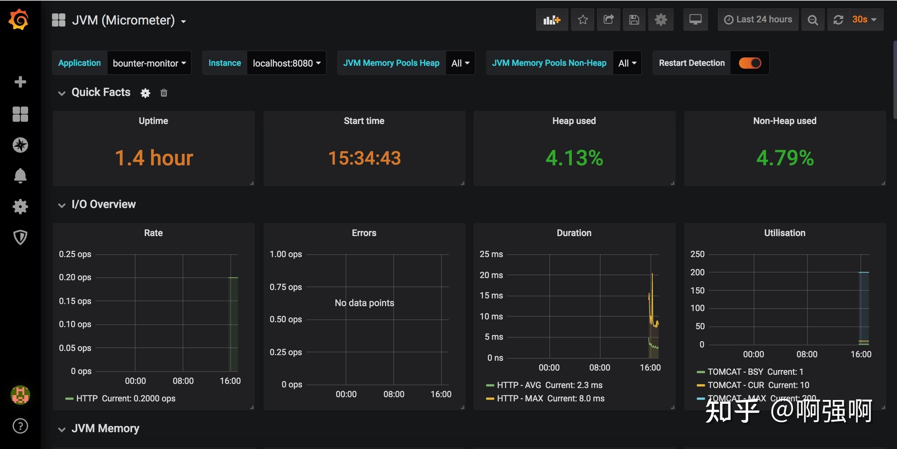
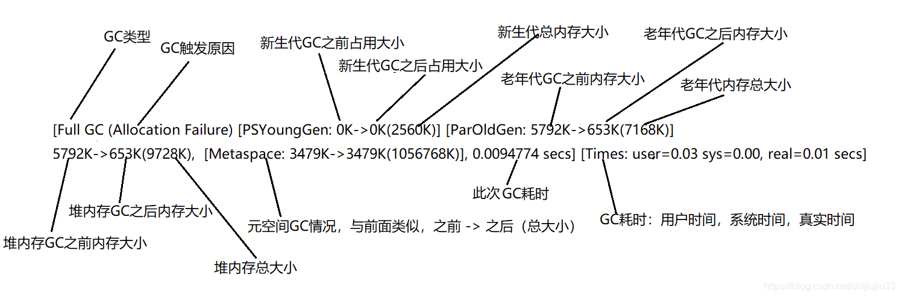

# java项目运行时的日志和监控

参考：

* [排查GC问题常用的工具](https://zhuanlan.zhihu.com/p/359288659)
* [开启-XX:+PrintGCDetails，具体日志内容分析](https://blog.csdn.net/shijiujiu33/article/details/104868390)

---

## 1 日志和监控

可以在Java程序启动的时候加上一些命令参数，来把程序运行中的GC日志打印出来。

* -XX:+PrintGC 输出GC日志
* -XX:+PrintGCDetails 输出GC的详细日志
* -XX:+PrintGCTimeStamps 输出GC的时间戳（以基准时间的形式）
* -XX:+PrintGCDateStamps 输出GC的时间戳（以日期的形式，如 2013-05-04T21:53:59.234+0800）
* -XX:+PrintHeapAtGC 在进行GC的前后打印出堆的信息
* -Xloggc:../logs/gc.log 日志文件的输出路径

有些命令可能在不同的Java版本适用。比如在Java 11中，就会提示你：-XX:+PrintGC is deprecated. Will use -Xlog:gc instead。

而输出的日志格式，也会根据不同的Java版本和GC有一些细微的差别，这个可以具体根据自己项目上的Java版本和GC去对应具体的格式。

**推荐GC日志与logback集成**，这样可以利用logback的日志切割功能。

再**配上可视化的监控工具和告警工具**，就能够及时知道JVM的状态和趋势数据。开源的解决方案推荐的是Prometheus（使用jmx_exporter） + Grafana。



## 2 -XX:+PrintGCDetails

程序运行时输出gc日志：

```
"C:\Program Files\Java\jdk1.8.0_111\bin\java.exe" -Xmx10m -Xms10m -XX:+PrintGCDetails...

[GC (System.gc()) [PSYoungGen: 2025K->488K(2560K)] 7145K->5824K(9728K), 0.0012223 secs] [Times: user=0.00 sys=0.00, real=0.00 secs] 
[Full GC (System.gc()) [PSYoungGen: 488K->0K(2560K)] [ParOldGen: 5336K->5792K(7168K)] 5824K->5792K(9728K), [Metaspace: 3479K->3479K(1056768K)], 0.0073629 secs] [Times: user=0.00 sys=0.00, real=0.01 secs] 

[GC (Allocation Failure) [PSYoungGen: 0K->0K(2560K)] 5792K->5792K(9728K), 0.0003410 secs] [Times: user=0.00 sys=0.00, real=0.00 secs] 
[GC (Allocation Failure) [PSYoungGen: 0K->0K(2560K)] 5792K->5792K(9728K), 0.0004555 secs] [Times: user=0.00 sys=0.00, real=0.00 secs] 
[Full GC (Allocation Failure) [PSYoungGen: 0K->0K(2560K)] [ParOldGen: 5792K->5792K(7168K)] 5792K->5792K(9728K), [Metaspace: 3479K->3479K(1056768K)], 0.0032795 secs] [Times: user=0.00 sys=0.00, real=0.00 secs] 
[GC (Allocation Failure) [PSYoungGen: 0K->0K(2560K)] 5792K->5792K(9728K), 0.0004670 secs] [Times: user=0.00 sys=0.00, real=0.00 secs] 
[Full GC (Allocation Failure) [PSYoungGen: 0K->0K(2560K)] [ParOldGen: 5792K->653K(7168K)] 5792K->653K(9728K), [Metaspace: 3479K->3479K(1056768K)], 0.0094774 secs] [Times: user=0.03 sys=0.00, real=0.01 secs] 

// 下面是堆内存总的概况，各区域所占大小，以及被使用情况
Heap
 PSYoungGen      total 2560K, used 20K [0x00000000ffd00000, 0x0000000100000000, 0x0000000100000000)
  eden space 2048K, 1% used [0x00000000ffd00000,0x00000000ffd05360,0x00000000fff00000)
  from space 512K, 0% used [0x00000000fff80000,0x00000000fff80000,0x0000000100000000)
  to   space 512K, 0% used [0x00000000fff00000,0x00000000fff00000,0x00000000fff80000)
 ParOldGen       total 7168K, used 6797K [0x00000000ff600000, 0x00000000ffd00000, 0x00000000ffd00000)
  object space 7168K, 94% used [0x00000000ff600000,0x00000000ffca3750,0x00000000ffd00000)
 Metaspace       used 3486K, capacity 4498K, committed 4864K, reserved 1056768K
  class space    used 387K, capacity 390K, committed 512K, reserved 1048576K

Process finished with exit code 0
```

各名词解释：

* Full GC：对整个堆内存空间的一次垃圾回收
* GC：对年轻代空间的一次垃圾回收
* Allocation Failure：“分配失败”，即为新对象分派内存不够
* System.gc()：执行该方法触发的GC

### 2.1 对full gc条目的解析：



## 3 测试例子

```
public class GCDetailsAnalyze {

    public static void main(String[] args) {

        SoftReference<byte[]> softReference = new SoftReference<>(new byte[5 * 1024 * 1024]);

        System.gc();

        byte[] bytes = new byte[6 * 1024 * 1024];
    }

}
```

输出日志如第2小节，代码与日志结合分析：

**首先，**

* 代码：首先**软引用**指向的对象5m，**主动进行GC**，这里的5m对象不会被回收；

* 日志：可以看出来`GC（ System.gc() ）`日志， [ParOldGen: 5336K->5792K(7168K)]
    >5m对象在老年代中，也并没有被回收；

**接着，**

* 代码：再创建一个6m对象，内存不够，JVM进行GC清理垃圾，会回收上面的5m对象；

* 日志：可以看出来Full GC（ Allocation Failure ）日志，[ParOldGen: 5792K->653K(7168K)]
    >5m对象在老年代中被回收了。