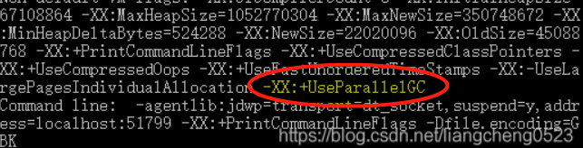
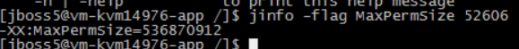
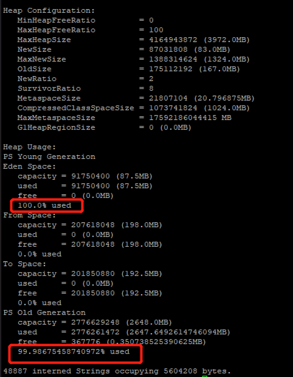

# java 异常排查四板斧

参考：

* [java堆栈常用排查指令](https://blog.csdn.net/qq_33326449/article/details/115865202)
* [java 查看堆内存_查看java内存情况的几个常用命令](https://blog.csdn.net/weixin_29062865/article/details/114058225)
* [【量产】如何查看正在运行中的JVM采用哪种GC算法策略](https://blog.csdn.net/m0_67400972/article/details/124100610)
* [Java中生成dump文件命令及分析工具下载](http://qclog.cn/1348)
* [设置堆内存大小](https://blog.csdn.net/chengqiuming/article/details/118539304)
* [JVM：jmap heap 堆参数分析MinHeapFreeRatio、MaxHeapFreeRatio、MaxHeapSize、NewSize、MaxNewSize](https://blog.csdn.net/claram/article/details/104635114)、
* [排查GC问题常用的工具](https://zhuanlan.zhihu.com/p/359288659)

## 0 查找java项目进程pid

### 0.1 jps

显示当前所有java进程pid的命令。

>缺点：只能显示当前用户的进程id，要显示其他用户的还只能用linux的ps命令。

* jps -l：输出应用程序main.class的完整package名或者应用程序jar文件完整路径名
* jps -v： 输出传递给JVM的参数

### 0.2 jps失效，linux提供的命令

* `ps -ef | grep java`
* `top | grep java`

## 1 查看java堆栈线程信息

说明：jstack命令打印指定Java进程、核心文件或远程调试服务器的**Java线程**的Java堆栈跟踪信息。

对于每个Java框架，完整的类名，方法名，字节码索引(BCI)和行号(如果有的话)会被打印出来。

使用-m选项，jstack命令打印程序中所有线程的Java和本机帧计数器(PC)。

>看不懂：对于每个本机帧，当可用时，将打印离PC最近的本机符号。c++乱码的名字不会被修改。要demangle c++名称，输出这个命令可以管道到c++filt。

当指定的进程在64位Java虚拟机上运行时，可能需要指定-J-d64选项，例如:

`jstack -J-d64 -m pid`

## 2 查看java系统启动配置型

说明：jinfo命令打印指定Java进程或核心文件或远程调试服务器的**Java配置信息**。配置信息包括Java system属性和Java虚拟机(JVM)命令行标记。

如果指定的进程在64位JVM上运行，那么您可能需要指定-J-d64选项，例如:

`jinfo-J-d64 -sysprops pid`

* 查看gc算法：`jinfo -flags pid`
    

* 查看运行时的java进程的运行参数：`jinfo -flag MaxPermSize 52606`
    

* 修改运行时的java进程的运行参数...

### 2.1 启动时修改jvm配置

* -XX:NewRatio=4（默认是2）：修改新生代：老年代=1：4
* -XX:SurvivorRatio = 8：Eden区与From区、To区的默认占比为 8:1:1
* -Xms：用于表示堆区的起始内存，等价于 -xx:InitialHeapSize
* -Xmx：用于表示堆区的最大内存，等价于 -XX:MaxHeapSize

```
# 最大堆内存10m、初始化堆内存10m
java -Xmx10m -Xms10m -jar test.jar
```

## 3 查看java进程堆内存信息

jmap命令打印指定进程、核心文件或远程调试服务器的**共享对象内存映射**或**堆内存详细信息**。

如果指定的进程在64位上运行Java虚拟机(JVM)，那么您可能需要指定-J-d64选项，
例如:

`jmap-J-d64 -heap pid`。

堆Dump是反映堆使用情况的内存镜像，其中主要包括系统信息、虚拟机属性、完整的线程Dump、所有类和对象的状态等。

一般在：

* 内存不足，
* GC异常

等情况下，我们会去**怀疑内存泄漏**，这个时候就会去**打印堆Dump**。

### 3.1 常见用法

* jmap pid：打印的信息分别为：共享对象的起始地址、映射大小、共享对象路径的全程。
* jmap -heap pid：查看堆使用情况
* jmap -histo pid：查看堆中对象数量和大小，打印的信息分别是：序列号、Class实例的数量、内存的占用、类限定名
    >如果是内部类，类名的开头会加上*，如果加上live子参数的话，如jmap -histo：live pid，这个命名会触发一次FUll GC，只统计存活对象

`jmap -heap pid`：



其中堆配置的各个字段意思：

字段|意思
:-|:-
MinHeapFreeRatio|空闲堆空间的最小百分比，计算公式为：HeapFreeRatio =(CurrentFreeHeapSize/CurrentTotalHeapSize) * 100，值的区间为0到100，默认值为 40。如果HeapFreeRatio < MinHeapFreeRatio，则需要进行堆扩容，扩容的时机应该在每次垃圾回收之后。
MaxHeapFreeRatio|空闲堆空间的最大百分比，计算公式为：HeapFreeRatio =(CurrentFreeHeapSize/CurrentTotalHeapSize) * 100，值的区间为0到100，默认值为 70。如果HeapFreeRatio > MaxHeapFreeRatio，则需要进行堆缩容，缩容的时机应该在每次垃圾回收之后。
MaxHeapSize|JVM 堆空间允许的最大值。
NewSize|JVM 新生代堆空间的默认值。
MaxNewSize|JVM 新生代堆空间允许的最大值。
OldSize|JVM 老年代堆空间的默认值。
NewRatio|新生代（2个Survivor区和Eden区 ）与老年代（不包括永久区）的堆空间比值，表示新生代：老年代=1：2。
SurvivorRatio|两个Survivor区和Eden区的堆空间比值为 8，表示 S0 ： S1 ：Eden = 1：1：8。
MetaspaceSize|初始化元空间大小，控制发生GC
CompressedClassSpaceSize|
MaxMetaspaceSize|JVM 元空间允许的最大值。防止占用过多物理内存。
G1HeapRegionSize|在使用 G1 垃圾回收算法时，JVM 会将 Heap 空间分隔为若干个 Region，该参数用来指定每个 Region 空间的大小。

### 3.2 导出堆dump

手动生成堆dump文件：

```
jmap -dump:format=b,file=/home/dump.hprof pid
```

* live 只dump存活的对象，如果不加则会dump所有对象
* format=b 表示以二进制格式
* file=filepath 输出到某个文件中

但一般来说，在启动java程序时可以通过指定jvm参数来配置：当发生OOM异常时**自动生成**dump文件，参数配置如下：

```
java -XX:+HeapDumpOnOutOfMemoryError -XX:HeapDumpPath=/home/dump.hprof -jar test.jar
```

## 4 查看java虚拟机状态信息

jstat工具特别强大，可详细查看堆内各个部分的使用量，以及加载类的数量。

* `jstat -class pid`:显示加载class的数量，及所占空间等信息。

* `jstat -compiler pid`:显示VM实时编译的数量等信息。

* `jstat -gc pid`:可以显示gc的信息，查看gc的次数，及时间。其中最后五项，分别是young gc的次数，young gc的时间，full gc的次数，full gc的时间，gc的总时间。

* `jstat -gccapacity`:可以显示，VM内存中三代(young,old,perm)对象的使用和占用大小，如：PGCMN显示的是最小perm的内存使用量，PGCMX显示的是perm的内存最大使用量，PGC是当前新生成的perm内存占用量，PC是但前perm内存占用量。其他的可以根据这个类推， OC是old内纯的占用量。

* `jstat -gcnew pid`:new对象的信息。

* `jstat -gcnewcapacity pid`:new对象的信息及其占用量。

* `jstat -gcold pid`:old对象的信息。

* `jstat -gcoldcapacity pid`:old对象的信息及其占用量。

* `jstat -gcpermcapacity pid`: perm对象的信息及其占用量。

* `jstat -util pid`:统计gc信息统计。

* `jstat -printcompilation pid`:当前VM执行的信息。

例1：

```
E:\javatest1\src\main\java\jvm>jstat -gc 4200
S0C    S1C    S0U    S1U      EC       EU        OC         OU       MC     MU    CCSC   CCSU   YGC     YGCT    FGC    FGCT     GCT
25600.0 25600.0  0.0    0.0   153600.0 12288.1   409600.0     0.0     4480.0 776.5  384.0   76.6       0    0.000   0      0.000    0.000
```

字段解释（单位是kB)：

```
S0C、S1C、S0U、S1U：Survivor 0/1区容量（Capacity）和使用量（Used）
EC、EU：Eden区容量和使用量
OC、OU：年老代容量和使用量
PC、PU：永久代容量和使用量
YGC、YGT：年轻代GC次数和GC耗时
FGC、FGCT：Full GC次数和Full GC耗时
GCT：GC总耗时
```

除了以上一个参数外，还可以同时加上 两个数字，如：jstat -printcompilation 3024 250 5是每250毫秒打印一次，一共打印5次，还可以加上-h3每三行显示一下标题：

```
[lushuan@220 tmp]$ sudo jstat -gcutil  16653 250 5
  S0     S1     E      O      M     CCS    YGC     YGCT    FGC    FGCT     GCT   
  0.00   5.21  72.79  22.09  85.64  89.06   6551  118.995     2    0.123  119.118
  0.00   5.21  72.97  22.09  85.64  89.06   6551  118.995     2    0.123  119.118
  0.00   5.21  72.97  22.09  85.64  89.06   6551  118.995     2    0.123  119.118
  0.00   5.21  72.97  22.09  85.64  89.06   6551  118.995     2    0.123  119.118
  0.00   5.21  72.97  22.09  85.64  89.06   6551  118.995     2    0.123  119.118
```