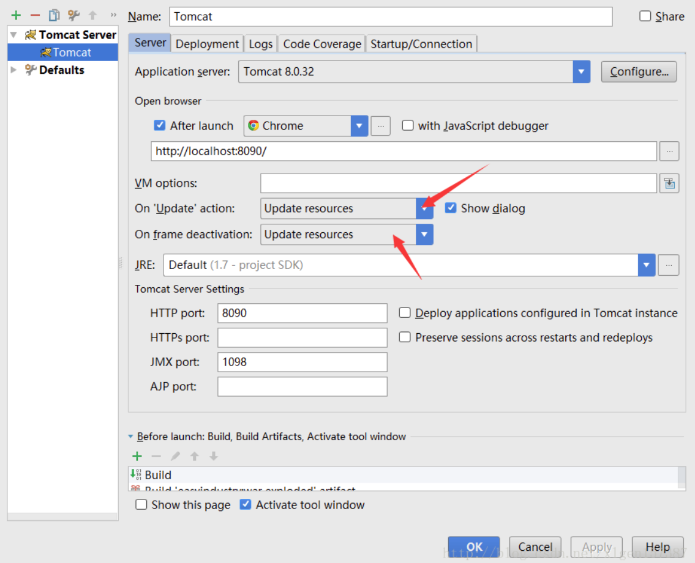

# tomcat部署war包注意事项

参考：[Tomcat部署时war和war exploded区别以及平时踩得坑](https://blog.csdn.net/xlgen157387/article/details/56498938)

## 1 war和war exploded的区别

1. `war`模式这种可以称之为是发布模式，看名字也知道，这是先打成war包，再发布；
2. `war exploded`模式是直接把文件夹、jsp页面 、classes等等移到Tomcat 部署文件夹里面，进行加载部署。因此这种方式支持**热部署**，一般在开发的时候也是用这种方式。

在平时开发的时候，使用热部署的话，应该对Tomcat进行相应的设置，这样的话修改的jsp界面什么的东西才可以及时的显示出来：

