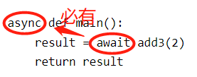

# python的异步io

参考：[python中的asyncio使用详解](https://blog.csdn.net/bluehawksky/article/details/106283636)

---

## 1 核心概念

* 普通函数定义：def
* 异步函数定义：async def，又称之为**协程函数**(Coroutine)

```
# 普通函数定义
def add2(x):
    print(x+2)
    return x+2

# 异步函数的定义
async def add3(x):
    print("in async fun add")
    return x+3
```

分别调用这两个函数：

```
add2(2)     # 返回4

add3(2)     # 返回一个coroutine对象，<coroutine object add3 at 0x000002ED564A5048>，并不是2+3=5这个结果
```

重点：协程函数想要执行需要放到**事件循环**里执行。

## 2 事件循环 Eventloop

`Eventloop` 是`asyncio`应用的核心，把一些异步函数注册到这个事件循环上，事件循环会循环执行这些函数，

* 当执行到某个函数时，如果它正在等待I/O返回，如它正在进行网络请求，或者sleep操作，事件循环会暂停它的执行去执行其他的函数；
* 当某个函数完成I/O后会恢复，下次循环到它的时候继续执行。

因此，这些异步函数可以协同(Cooperative)运行：这就是事件循环的目标。

## 3 执行异步函数

### 3.1 放入事件循环中

```
import asyncio

loop = asyncio.get_event_loop()

async def add3(x):
    print("in async fun add")
    return x+3

result = loop.run_until_complete(add3(2))
print(result)

#运行的结果是
#in async fun add
#5
```

### 3.2 await修饰函数调用

await只能用在协程函数中，所以想要用await关键字就还需要定义一个协程函数。

即有await，则函数方法声明必有async：



但main()最终还是要放进事件循环里调用：

```
async def main():
    result = await add3(2)
    return result

loop = asyncio.get_event_loop()
loop.run_until_complete(main())
```

## 4 同步执行多个异步函数

```
# coding:utf-8

import asyncio
import time


async def testa(x):
    print("in test a")
    await asyncio.sleep(3)
    print("Resuming a")
    return x


async def testb(x):
    print("in test b")
    await asyncio.sleep(1)
    print('Resuming b')
    return x


async def main():
    start = time.time()
    resulta = await testa(1)
    resultb = await testb(2)
    print("test a result is %d"%resulta)
    print("test b result is %d"%resultb)
    print("use %s time"%(time.time()-start))

if __name__ == '__main__':
    loop = asyncio.get_event_loop()
    loop.run_until_complete(main())
```

输出：

```
in test a
Resuming a
in test b
Resuming b
test a result is 1
test b result is 2
use 4.001966714859009 time
```

先执行了testa函数，然后再执行了testb函数，是串行的依次执行的。

## 5 并发执行多个异步函数--方法1

### 5.1 asyncio.gather()

如上1小节中定义了两个协程，并将它们放到另外一个协程main函数中，想要获得它们运行的结果。

事件循环的特点是当它遇到某个I/O需要等待(如这里的asyncio.sleep()函数)的时候，可以去执行其它的函数，这样，整个函数执行所需要的时间，应该是所有协程中执行时间最长的那个。

想要实现如上说法，必须得需要将协程放到`asyncio.gather()` 中运行，让它们并发执行：

```
async def main():
    start = time.time()
    resulta,resultb = await asyncio.gather(testa(1),testb(2))
    print("test a result is %d" % resulta)
    print("test b result is %d" % resultb)
    print("use %s time" % (time.time() - start))

if __name__ == '__main__':
    loop = asyncio.get_event_loop()
    loop.run_until_complete(main())
```

输出：

```
in test b
in test a
Resuming b
Resuming a
test a result is 1
test b result is 2
use 3.001237392425537 time
```

注意，这里是gather()函数里的每一个协程函数都执行完了，它才返回结果，结果是一个列表，列表里的值顺序和放到gather函数里的协程的顺序是一致的。

### 5.2 asyncio.wait()

asyncio.wait()函数，它的参数是协程的列表。

```
async def main():
    start = time.time()
    done,pending = await asyncio.wait([testa(1),testb(2)])
    print(list(done))
    print(list(pending))
    print(list(done)[0].result())
    print("use %s time" % (time.time() - start))

if __name__ == '__main__':
    loop = asyncio.get_event_loop()
    loop.run_until_complete(main())
```

asyncio.wait() 返回一个tuple对象，对象里又包含一个已经完成的任务set和未完成任务的set，上面代码得到的结果是：

```
in test b
in test a
Resuming b
Resuming a
[<Task finished coro=<testa() done, defined at F:/python/python3Test/asynctest.py:7> result=1>, <Task finished coro=<testb() done, defined at F:/python/python3Test/asynctest.py:14> result=2>]
[]
1
use 3.0003058910369873 time
```

### 5.3 gather和wait的区别

* gather需要所有任务都执行结束，如果某一个协程函数崩溃了，则会抛异常，都不会有结果。
* wait可以定义函数返回的时机，可以是：
    * FIRST_COMPLETED(第一个结束的), 
    * FIRST_EXCEPTION(第一个出现异常的), 
    * ALL_COMPLETED(全部执行完，默认的)

如下面的示例：要求在出现第一个异常的时候就结果，函数整体不会崩溃，只是如果这里想要获取结果的话它是一个异常对象。

```
# coding:utf-8

import asyncio
import time


async def testa(x):
    print("in test a")

    await asyncio.sleep(3)
    print(1/0)
    print("Resuming a")
    return x


async def testb(x):
    print("in test b")
    await asyncio.sleep(1)
    print(1/0)
    print('Resuming b')
    return x


async def main():
    start = time.time()
    done,pending = await asyncio.wait([testa(1),testb(2)],return_when=asyncio.tasks.FIRST_EXCEPTION)
    print(list(done))
    print(list(pending))
    print("use %s time" % (time.time() - start))

if __name__ == '__main__':
    loop = asyncio.get_event_loop()
    loop.run_until_complete(main())
```

输出：

```
in test b
in test a
[<Task finished coro=<testb() done, defined at F:/python/python3Test/asynctest.py:16> exception=ZeroDivisionError('division by zero',)>]
[<Task pending coro=<testa() running at F:/python/python3Test/asynctest.py:10> wait_for=<Future pending cb=[Task._wakeup()]>>]
use 1.0000195503234863 time
```

## 6 并发执行多个异步函数--方法2

### 6.1 asyncio.ensure_future()

```
async def main():
    start = time.time()

    taska = asyncio.ensure_future(testa(1))     # 返回一个task对象，此时task进入pending状态，并没有执行
    taskb = asyncio.ensure_future(testb(2))

    print(taska)                                # 返回<Task pending coro=<testa() running at F:/python/python3Test/asynctest.py:7>>
    print(taskb)
    print(taska.done(), taskb.done())           # 返回False,表示它还没有结束
    await taskb                                 # 表示开始执行该协程
    await taska
    print(taska.done(), taskb.done())           # 当执行结束以后，taska.done() 返回True，

    print(taskb.result())                       # taska.done() 返回True，这时可以调用taska.result() 得到函数的返回值，如果协程还没有结束就调用result()方法则会抛个异常，raise InvalidStateError('Result is not ready.').
    print(taska.result())
    print("use %s time" % (time.time() - start))

if __name__ == '__main__':
    loop = asyncio.get_event_loop()
    loop.run_until_complete(main())
```

### 6.2 loop.create_task()

创建task对象除了使用asyncio.ensure_future()方法还可以使用loop.create_task() 方法。

```
async def main():
    start = time.time()

    taska = loop.create_task(testa(1))
    taskb = loop.create_task(testb(2))

    print(taska)
    print(taskb)
    print(taska.done(), taskb.done())
    await taskb
    await taska
    print(taska.done(), taskb.done())

    print(taskb.result())
    print(taska.result())
    print("use %s time" % (time.time() - start))

if __name__ == '__main__':
    loop = asyncio.get_event_loop()
    loop.run_until_complete(main())
```