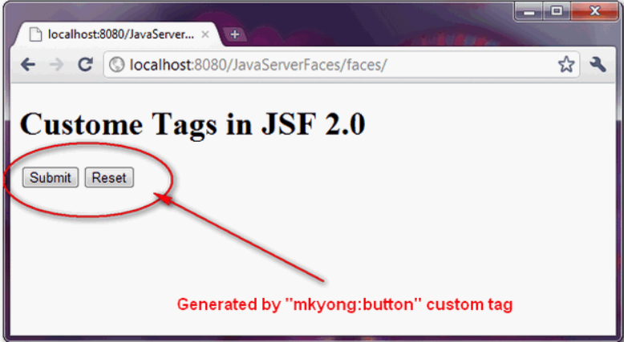

# JSF 2.0标签

## 1 自定义标签示例

参考：[JSF 2.0中的自定义标签](https://blog.csdn.net/cyan20115/article/details/106550783)

---

创建自定义标签的指南，它将在页面中插入两个预定义的提交和重置按钮。

### 1.1 定义标签

创建一个普通的XHTML文件来实现自定义标签，该标签使用“ ui：composition”标签将提交和重置按钮组合在一起。

`WEB-INF / tags / com / mkyong / button.xhtml`：

```
<?xml version="1.0" encoding="UTF-8"?>
<!DOCTYPE html PUBLIC "-//W3C//DTD XHTML 1.0 Transitional//EN" 
"http://www.w3.org/TR/xhtml1/DTD/xhtml1-transitional.dtd">
<html xmlns="http://www.w3.org/1999/xhtml"   
      xmlns:h="http://java.sun.com/jsf/html"
      xmlns:ui="http://java.sun.com/jsf/facelets"
      >
    <h:body>
       <ui:composition>
	
		<h:commandButton type="submit" value="#{buttonSubmitLabel}" />
		<h:commandButton type="reset" value="#{buttonResetLabel}" />
				
       </ui:composition>
    </h:body>
</html>
```

### 1.2 定义标签库

在标签库描述符文件中定义自定义标签详细信息。

* 名称空间：此标记库的名称空间，创建一个唯一的名称以避免冲突。
* tag-name：自定义标签名称。
* 源：自定义标签的实现。

`WEB-INF \ mkyong.taglib.xml`：

```
<?xml version="1.0"?>
<!DOCTYPE facelet-taglib PUBLIC
  "-//Sun Microsystems, Inc.//DTD Facelet Taglib 1.0//EN"
  "http://java.sun.com/dtd/facelet-taglib_1_0.dtd">
<facelet-taglib>
    <namespace>http://mkyong.com/facelets</namespace>
    <tag>
	<tag-name>button</tag-name>
	<source>tags/com/mkyong/button.xhtml</source>
    </tag>
</facelet-taglib>
```

### 1.3 注册标签库

将标签库注册到web.xml文件中。

```
<!-- Load custom tag into JSF web application -->
 <context-param>
    <param-name>facelets.LIBRARIES</param-name>
    <param-value>/WEB-INF/mkyong.taglib.xml</param-value>
 </context-param>
```

### 1.4 使用自定义标签

要使用定制标记，您必须在顶部声明其命名空间，并像普通的JSF标记一样使用它。

```
<?xml version="1.0" encoding="UTF-8"?>
<!DOCTYPE html PUBLIC "-//W3C//DTD XHTML 1.0 Transitional//EN" 
"http://www.w3.org/TR/xhtml1/DTD/xhtml1-transitional.dtd">
<html xmlns="http://www.w3.org/1999/xhtml"   
      xmlns:h="http://java.sun.com/jsf/html"
      xmlns:ui="http://java.sun.com/jsf/facelets"
      xmlns:mkyong="http://mkyong.com/facelets"
      >
    <h:body>
    	<h1>Custome Tags in JSF 2.0</h1>
    	
    	<mkyong:button 
    		buttonSubmitLabel="Submit" 
    		buttonResetLabel="Reset" />
    	
    </h:body>
</html>
```

### 1.5 结果

“ mkyong：button”自定义标记将呈现一个提交按钮和一个重置按钮。



## 2 Facelets UI 标签

参考：[Facelets UI 标签参考](https://blog.csdn.net/u011038738/article/details/41979603)

## 3 JSTL C标签

参考：[JSTL【一】C标签的使用](https://blog.csdn.net/fjh_1205/article/details/80052162)